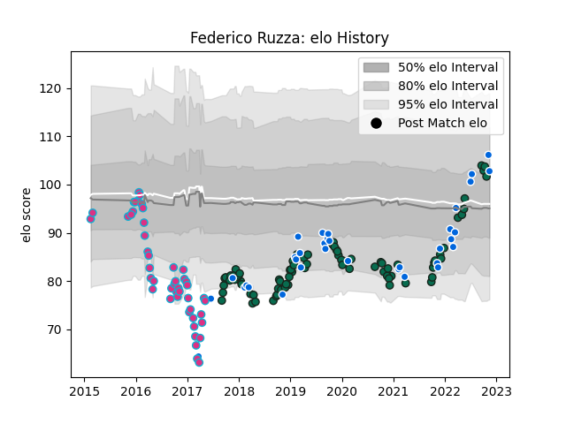

---  
layout: page  
title: Federico Ruzza  
date: 2023-03-17 17:09:45.642861  
categories: player  
---
# Federico Ruzza

## Positions: L, FL

## Country: Italy

## Current elo: 104.0

## Current Percentile: 87.0

# Elo History

# Match History

| Team             |   Appearances |   Win Rate |
|:-----------------|--------------:|-----------:|
| Benetton Treviso |            92 |   0.467391 |
| Zebre            |            47 |   0.170213 |
| Italy            |            40 |   0.225    |

| Opponent             |   Matches |   Win Rate |
|:---------------------|----------:|-----------:|
| Zebre                |        11 |   0.818182 |
| Scarlets             |        11 |   0.181818 |
| Glasgow Warriors     |        11 |   0.272727 |
| Ulster               |        10 |   0.15     |
| Dragons              |        10 |   0.8      |
| Edinburgh            |        10 |   0.5      |
| Leinster             |         9 |   0.166667 |
| Munster              |         8 |   0        |
| Connacht             |         7 |   0.142857 |
| France               |         7 |   0        |
| Ospreys              |         7 |   0.142857 |
| Cardiff Blues        |         6 |   0.166667 |
| Ireland              |         5 |   0        |
| England              |         5 |   0        |
| Southern Kings       |         4 |   1        |
| Scotland             |         4 |   0        |
| Wales                |         4 |   0.25     |
| Stade Francais Paris |         3 |   0.666667 |
| Agen                 |         3 |   0.666667 |
| Benetton Treviso     |         3 |   0.333333 |
| Grenoble             |         2 |   1        |
| Northampton Saints   |         2 |   0        |
| Wasps                |         2 |   0        |
| Toulon               |         2 |   0        |
| Bayonne              |         2 |   1        |
| South Africa         |         2 |   0        |
| Cheetahs             |         2 |   0.5      |
| Lyon                 |         2 |   0        |
| Gloucester Rugby     |         2 |   0        |
| La Rochelle          |         2 |   0.5      |
| Argentina            |         2 |   0        |
| New Zealand          |         1 |   0        |
| Georgia              |         1 |   0        |
| Worcester Warriors   |         1 |   1        |
| Australia            |         1 |   1        |
| Uruguay              |         1 |   1        |
| Bath Rugby           |         1 |   0        |
| Stormers             |         1 |   1        |
| Stade Toulousain     |         1 |   0        |
| Lions                |         1 |   0        |
| Namibia              |         1 |   1        |
| Bulls                |         1 |   0        |
| Canada               |         1 |   1        |
| Samoa                |         1 |   1        |
| Harlequins           |         1 |   0        |
| Romania              |         1 |   1        |
| Portugal             |         1 |   1        |
| Perpignan            |         1 |   1        |
| Fiji                 |         1 |   0        |
| Russia               |         1 |   1        |