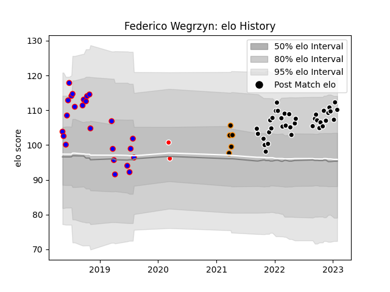

---  
layout: page  
title: Federico Wegrzyn  
date: 2023-02-02 18:51:22.019625  
categories: player  
---
# Federico Wegrzyn

## Positions: P, L

## Current elo: 110.0

## Current Percentile: 87.0

# Elo History

# Match History

| Team           |   Appearances |   Win Rate |
|:---------------|--------------:|-----------:|
| Provence Rugby |            37 |   0.581081 |
| San Luis       |            24 |   0.708333 |
| Jaguares XV    |             5 |   1        |
| Ceibos Rugby   |             2 |   1        |

| Opponent             |   Matches |   Win Rate |
|:---------------------|----------:|-----------:|
| Beziers              |         4 |   0.75     |
| Montauban            |         4 |   0.75     |
| Grenoble             |         4 |   0.875    |
| Vannes               |         3 |   0.333333 |
| Belgrano             |         3 |   0.666667 |
| Regatas Bella Vista  |         3 |   0.333333 |
| Oyonnax              |         3 |   0.5      |
| Newman               |         3 |   0.666667 |
| Mont-de-Marsan       |         3 |   0.666667 |
| La Plata             |         2 |   0.5      |
| Selknam              |         2 |   1        |
| San Martin           |         2 |   1        |
| Rouen                |         2 |   0.5      |
| Olimpia Lions        |         2 |   1        |
| Alumni               |         2 |   1        |
| Agen                 |         2 |   0        |
| Hindu                |         2 |   0.5      |
| Carcassonne          |         2 |   1        |
| Aurillac             |         2 |   0.5      |
| Bayonne              |         2 |   0.5      |
| CASI                 |         2 |   1        |
| Lomas                |         2 |   1        |
| Colomiers            |         2 |   0.5      |
| Cafeteros Pro        |         1 |   1        |
| CUBA                 |         1 |   0        |
| Massy                |         1 |   0        |
| Narbonne             |         1 |   0        |
| Cobras               |         1 |   1        |
| SIC                  |         1 |   1        |
| Atlético del Rosario |         1 |   1        |
| Soyaux-Angouleme     |         1 |   1        |
| US Bressane          |         1 |   0.5      |
| Penarol Rugby        |         1 |   1        |