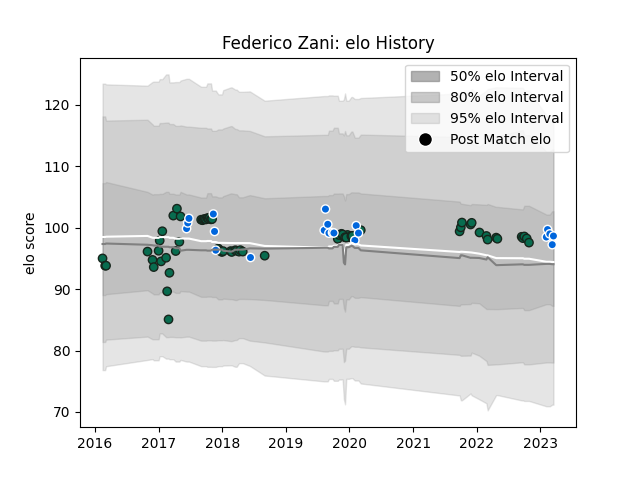

---  
layout: page  
title: Federico Zani  
date: 2023-01-06 00:12:45.255661  
categories: player  
---
# Federico Zani

## Positions: P

## Country: Italy

## Current elo: 104.0

## Current Percentile: 43.0

# Elo History

# Match History

| Team             |   Appearances |   Win Rate |
|:-----------------|--------------:|-----------:|
| Benetton Treviso |            70 |     0.4    |
| Italy            |            16 |     0.1875 |

| Opponent           |   Matches |   Win Rate |
|:-------------------|----------:|-----------:|
| Zebre              |         8 |   0.875    |
| Edinburgh          |         7 |   0.571429 |
| Leinster           |         6 |   0.166667 |
| Scarlets           |         6 |   0.166667 |
| Glasgow Warriors   |         6 |   0.333333 |
| Dragons            |         5 |   0.8      |
| Munster            |         4 |   0        |
| Cardiff Blues      |         4 |   0.25     |
| Ulster             |         3 |   0        |
| Connacht           |         3 |   0        |
| Southern Kings     |         3 |   1        |
| South Africa       |         2 |   0        |
| Lyon               |         2 |   0.5      |
| Scotland           |         2 |   0        |
| Fiji               |         2 |   0.5      |
| France             |         2 |   0        |
| Ospreys            |         2 |   1        |
| Northampton Saints |         2 |   0        |
| Sharks             |         1 |   0        |
| Stormers           |         1 |   1        |
| Russia             |         1 |   1        |
| Toulon             |         1 |   0        |
| Wales              |         1 |   0        |
| Argentina          |         1 |   0        |
| Lions              |         1 |   0        |
| Australia          |         1 |   0        |
| Japan              |         1 |   0        |
| Ireland            |         1 |   0        |
| Gloucester Rugby   |         1 |   0        |
| England            |         1 |   0        |
| Cheetahs           |         1 |   1        |
| Canada             |         1 |   1        |
| Bulls              |         1 |   0        |
| Bath Rugby         |         1 |   0        |
| La Rochelle        |         1 |   0        |