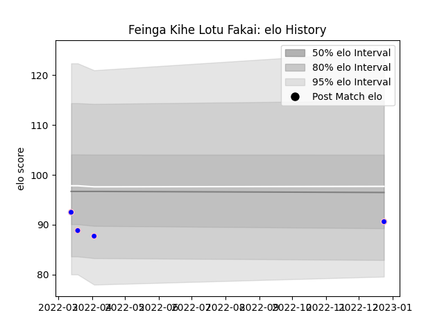

---  
layout: page  
title: Feinga Kihe Lotu Fakai  
date: 2022-12-28 12:56:48.509688  
categories: player  
---
# Feinga Kihe Lotu Fakai

## Positions: N8

## Current elo: 91.0

## Current Percentile: 23.0

# Elo History

# Match History

| Team              |   Appearances |   Win Rate |
|:------------------|--------------:|-----------:|
| Kurita Water Gush |             4 |          0 |

| Opponent                         |   Matches |   Win Rate |
|:---------------------------------|----------:|-----------:|
| Chugoku Red Regulions            |         1 |          0 |
| Kyuden Voltex                    |         1 |          0 |
| Munakata Sanix Blues             |         1 |          0 |
| Toyota Industries Shuttles Aichi |         1 |          0 |