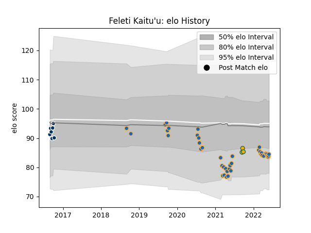

---  
layout: page  
title: Feleti Kaitu'u  
date: 2023-03-21 18:43:42.821206  
categories: player  
---
# Feleti Kaitu'u

Last updated: 2023-03-21
## Positions: H

## Country: Australia

## Current elo: 84.0

## Current Percentile: 18.0

# Elo History

# Match History

| Team               |   Appearances |   Win Rate |
|:-------------------|--------------:|-----------:|
| Western Force      |            40 |   0.325    |
| Queensland Country |             7 |   0.142857 |
| Australia          |             3 |   1        |

| Opponent                 |   Matches |   Win Rate |
|:-------------------------|----------:|-----------:|
| Brumbies                 |         7 |   0        |
| Melbourne Rebels         |         5 |   0.4      |
| New South Wales Waratahs |         5 |   0.4      |
| Queensland Reds          |         4 |   0.25     |
| Brisbane City            |         3 |   0.666667 |
| Fijian Drua              |         3 |   0.666667 |
| Hurricanes               |         2 |   0.5      |
| Canberra Vikings         |         2 |   0.5      |
| Chiefs                   |         2 |   0        |
| Crusaders                |         2 |   0        |
| South Africa             |         2 |   1        |
| Highlanders              |         2 |   0        |
| Blues                    |         2 |   0        |
| NSW Country Eagles       |         2 |   0.5      |
| North Harbour Rays       |         1 |   0        |
| Perth Spirit             |         1 |   0        |
| Argentina                |         1 |   1        |
| Moana Pasifika           |         1 |   1        |
| Melbourne Rising         |         1 |   0        |
| Greater Sydney Rams      |         1 |   0        |
| Sydney Rays              |         1 |   1        |