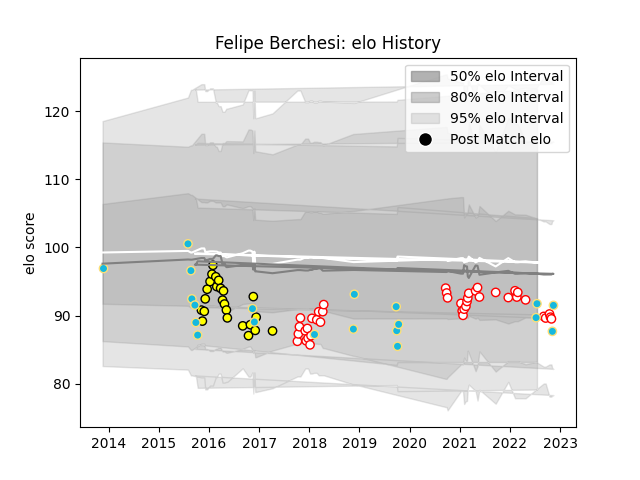

---  
layout: page  
title: Felipe Berchesi  
date: 2022-11-22 11:35:50.300110  
categories: player  
---
# Felipe Berchesi

## Positions: FH, C

## Country: Uruguay

## Current elo: 92.0

## Current Percentile: 37.0

# Elo History

# Match History

| Team        |   Appearances |   Win Rate |
|:------------|--------------:|-----------:|
| Dax         |            41 |   0.47561  |
| Carcassonne |            24 |   0.416667 |
| Uruguay     |            20 |   0.35     |

| Opponent                   |   Matches |   Win Rate |
|:---------------------------|----------:|-----------:|
| Albi                       |         5 |   0        |
| Narbonne                   |         5 |   0.6      |
| Romania                    |         5 |   0.6      |
| Mont-de-Marsan             |         4 |   0.25     |
| Biarritz Olympique         |         4 |   0.5      |
| Aurillac                   |         4 |   0.5      |
| Perpignan                  |         3 |   0        |
| Beziers                    |         3 |   0.333333 |
| Blagnac                    |         3 |   0.666667 |
| Montauban                  |         3 |   0.333333 |
| Chambery                   |         3 |   1        |
| Colomiers                  |         3 |   0.333333 |
| Dijon                      |         2 |   1        |
| Tarbes                     |         2 |   0        |
| Japan                      |         2 |   0        |
| Georgia                    |         2 |   0        |
| Fiji                       |         2 |   0.5      |
| Wales                      |         2 |   0        |
| Dax                        |         2 |   0.5      |
| Cognac Saint Jean d'Angély |         2 |   0        |
| Carcassonne                |         2 |   0        |
| Bourgoin-Jallieu           |         2 |   1        |
| Bayonne                    |         2 |   0.25     |
| Australia                  |         2 |   0        |
| Aubenas                    |         2 |   0.5      |
| Vannes                     |         2 |   1        |
| Suresnes                   |         2 |   0.5      |
| Spain                      |         1 |   1        |
| US Bressane                |         1 |   1        |
| Valence Romans Drome Rugby |         1 |   1        |
| Agen                       |         1 |   0        |
| Soyaux-Angouleme           |         1 |   1        |
| Provence Rugby             |         1 |   1        |
| Germany                    |         1 |   0        |
| Canada                     |         1 |   1        |
| Argentina                  |         1 |   1        |
| England                    |         1 |   0        |