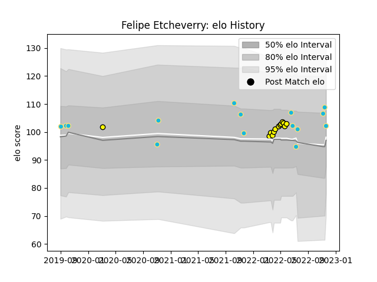

---  
layout: page  
title: Felipe Etcheverry  
date: 2023-03-21 18:13:28.493203  
categories: player  
---
# Felipe Etcheverry

Last updated: 2023-03-21
## Positions: FH, FB

## Country: Uruguay

## Current elo: 102.0

## Current Percentile: 80.0

# Elo History

# Match History

| Team          |   Appearances |   Win Rate |
|:--------------|--------------:|-----------:|
| Uruguay       |            15 |   0.4      |
| Penarol Rugby |            13 |   0.769231 |

| Opponent                 |   Matches |   Win Rate |
|:-------------------------|----------:|-----------:|
| Romania                  |         4 |        0.5 |
| Selknam                  |         4 |        0.5 |
| Cafeteros Pro            |         3 |        1   |
| Cobras                   |         2 |        1   |
| Jaguares XV              |         2 |        1   |
| Japan                    |         2 |        0   |
| Olimpia Lions            |         2 |        0.5 |
| Spain                    |         2 |        0.5 |
| Australia                |         1 |        0   |
| Brazil                   |         1 |        1   |
| Fiji                     |         1 |        1   |
| Georgia                  |         1 |        0   |
| Italy                    |         1 |        0   |
| Tonga                    |         1 |        0   |
| United States of America |         1 |        1   |