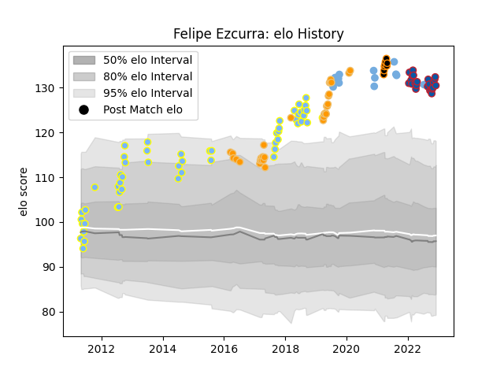

---  
layout: page  
title: Felipe Ezcurra  
date: 2023-01-13 11:32:51.803913  
categories: player  
---
# Felipe Ezcurra

## Positions: SH

## Country: Argentina

## Current elo: 126.0

## Current Percentile: 96.0

# Elo History

# Match History

| Team        |   Appearances |   Win Rate |
|:------------|--------------:|-----------:|
| Hindu       |            68 |   0.786765 |
| Jaguares    |            32 |   0.59375  |
| Grenoble    |            28 |   0.589286 |
| Argentina   |            14 |   0.285714 |
| Jaguares XV |             9 |   1        |

| Opponent                 |   Matches |   Win Rate |
|:-------------------------|----------:|-----------:|
| Newman                   |         9 |   0.666667 |
| SIC                      |         6 |   1        |
| CUBA                     |         6 |   0.666667 |
| Belgrano                 |         5 |   0.6      |
| Regatas Bella Vista      |         4 |   0.875    |
| Lomas                    |         4 |   1        |
| Pucara                   |         4 |   0.75     |
| Sharks                   |         4 |   0.5      |
| San Martin               |         4 |   0.75     |
| CASI                     |         4 |   0.375    |
| San Luis                 |         4 |   1        |
| Lions                    |         3 |   0.666667 |
| La Plata                 |         3 |   0.5      |
| Provence Rugby           |         3 |   0.166667 |
| Chiefs                   |         3 |   0.333333 |
| Queensland Reds          |         3 |   1        |
| Alumni                   |         3 |   0.666667 |
| South Africa             |         3 |   0        |
| Australia                |         3 |   0.333333 |
| Sunwolves                |         3 |   0.666667 |
| Mont-de-Marsan           |         2 |   0.5      |
| Selknam                  |         2 |   1        |
| Southern Kings           |         2 |   0.5      |
| Penarol Rugby            |         2 |   1        |
| Olimpia Lions            |         2 |   1        |
| Stormers                 |         2 |   0.5      |
| New Zealand              |         2 |   0        |
| New South Wales Waratahs |         2 |   1        |
| Nevers                   |         2 |   1        |
| Vannes                   |         2 |   0        |
| Agen                     |         2 |   0.5      |
| Montauban                |         2 |   1        |
| Crusaders                |         2 |   0        |
| Cafeteros Pro            |         2 |   1        |
| Los Tilos                |         2 |   1        |
| Carcassonne              |         2 |   1        |
| Brumbies                 |         2 |   1        |
| Beziers                  |         2 |   0.5      |
| Colomiers                |         2 |   0        |
| Bulls                    |         2 |   0.5      |
| Aurillac                 |         2 |   1        |
| Highlanders              |         2 |   0        |
| Atlético del Rosario     |         2 |   1        |
| Bayonne                  |         1 |   1        |
| Soyaux-Angouleme         |         1 |   1        |
| Tonga                    |         1 |   1        |
| Biarritz Olympique       |         1 |   0.5      |
| US Bressane              |         1 |   1        |
| Buenos Aires             |         1 |   1        |
| United States of America |         1 |   1        |
| Scotland                 |         1 |   0        |
| Manuel Belgrano          |         1 |   1        |
| San Albano               |         1 |   1        |
| San Cirano               |         1 |   1        |
| San Andres               |         1 |   1        |
| Rouen                    |         1 |   1        |
| Champagnat               |         1 |   1        |
| Cheetahs                 |         1 |   1        |
| Cobras                   |         1 |   1        |
| Oyonnax                  |         1 |   0        |
| Olivos                   |         1 |   1        |
| England                  |         1 |   0        |
| France                   |         1 |   0        |
| Hurricanes               |         1 |   1        |
| Liceo Militar            |         1 |   1        |
| Narbonne                 |         1 |   0.5      |
| Wales                    |         1 |   1        |