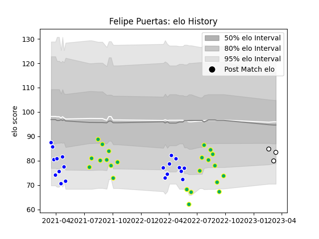

---  
layout: page  
title: Felipe Puertas  
date: 2023-03-17 17:33:25.178349  
categories: player  
---
# Felipe Puertas

## Positions: FL, N8

## Current elo: 83.0

## Current Percentile: 10.0

# Elo History

# Match History

| Team          |   Appearances |   Win Rate |
|:--------------|--------------:|-----------:|
| Los Tilos     |            23 |   0.26087  |
| Cafeteros Pro |            20 |   0.2      |
| Yacare XV     |             3 |   0.666667 |

| Opponent             |   Matches |   Win Rate |
|:---------------------|----------:|-----------:|
| Cobras               |         5 |   0.6      |
| Selknam              |         4 |   0        |
| Jaguares XV          |         4 |   0        |
| Penarol Rugby        |         4 |   0        |
| Olimpia Lions        |         4 |   0.5      |
| Pucara               |         3 |   0.333333 |
| Newman               |         3 |   0        |
| San Luis             |         2 |   0.5      |
| Regatas Bella Vista  |         2 |   1        |
| Alumni               |         2 |   0        |
| CUBA                 |         2 |   0        |
| CASI                 |         2 |   0.5      |
| Buenos Aires         |         2 |   0.5      |
| Hindu                |         2 |   0        |
| American Raptors     |         1 |   1        |
| Dogos XV             |         1 |   0        |
| Belgrano             |         1 |   0        |
| SIC                  |         1 |   0        |
| Atlético del Rosario |         1 |   0        |