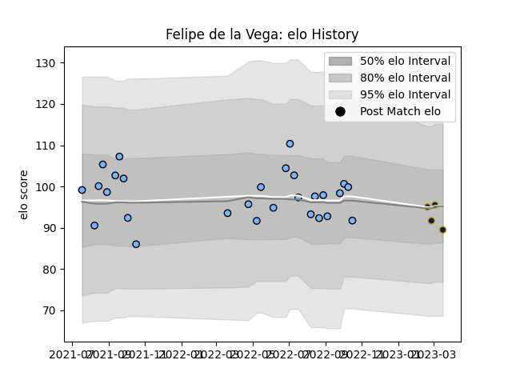

---  
layout: page  
title: Felipe de la Vega  
date: 2023-03-21 18:39:45.139481  
categories: player  
---
# Felipe de la Vega

Last updated: 2023-03-21
## Positions: C, FH

## Current elo: 89.0

## Current Percentile: 48.0

# Elo History

# Match History

| Team      |   Appearances |   Win Rate |
|:----------|--------------:|-----------:|
| CUBA      |            28 |   0.678571 |
| Pampas XV |             4 |   0.5      |

| Opponent             |   Matches |   Win Rate |
|:---------------------|----------:|-----------:|
| Belgrano             |         3 |   1        |
| Hindu                |         3 |   0        |
| Newman               |         3 |   0.333333 |
| Pucara               |         3 |   1        |
| Regatas Bella Vista  |         3 |   0.666667 |
| Alumni               |         2 |   0.5      |
| Atlético del Rosario |         2 |   1        |
| CASI                 |         2 |   1        |
| Los Tilos            |         2 |   1        |
| SIC                  |         2 |   0        |
| San Luis             |         2 |   1        |
| American Raptors     |         1 |   1        |
| Buenos Aires         |         1 |   1        |
| Cobras               |         1 |   1        |
| Dogos XV             |         1 |   0        |
| Selknam              |         1 |   0        |