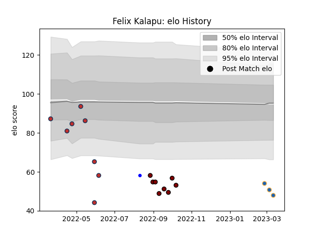

---  
layout: page  
title: Felix Kalapu  
date: 2023-03-17 17:33:54.667528  
categories: player  
---
# Felix Kalapu

## Positions: FL, L

## Current elo: 48.0

## Current Percentile: 2.0

# Elo History

# Match History

| Team          |   Appearances |   Win Rate |
|:--------------|--------------:|-----------:|
| North Harbour |             8 |   0.5      |
| Old Glory DC  |             8 |   0.375    |
| Western Force |             3 |   0.666667 |
| Auckland      |             1 |   1        |

| Opponent               |   Matches |   Win Rate |
|:-----------------------|----------:|-----------:|
| Auckland               |         1 |          0 |
| Bay of Plenty          |         1 |          0 |
| Toronto Arrows         |         1 |          1 |
| Taranaki               |         1 |          1 |
| Southland              |         1 |          1 |
| Rugby New York         |         1 |          0 |
| Rugby ATL              |         1 |          0 |
| R.U. New York          |         1 |          0 |
| Queensland Reds        |         1 |          0 |
| Northland              |         1 |          1 |
| New England Free Jacks |         1 |          0 |
| NOLA Gold              |         1 |          0 |
| Moana Pasifika         |         1 |          1 |
| Melbourne Rebels       |         1 |          1 |
| Manawatu               |         1 |          1 |
| Hawke's Bay            |         1 |          0 |
| Dallas Jackals         |         1 |          1 |
| Counties Manukau       |         1 |          1 |
| Canterbury             |         1 |          0 |
| Utah Warriors          |         1 |          1 |