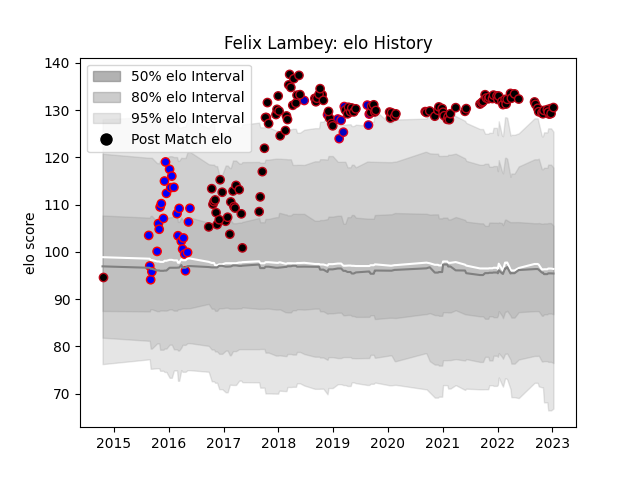

---  
layout: page  
title: Felix Lambey  
date: 2022-12-09 13:19:31.018084  
categories: player  
---
# Felix Lambey

## Positions: L

## Country: France

## Current elo: 121.0

## Current Percentile: 96.0

# Elo History

# Match History

| Team    |   Appearances |   Win Rate |
|:--------|--------------:|-----------:|
| Lyon    |           120 |   0.545833 |
| Beziers |            21 |   0.690476 |
| France  |             9 |   0.444444 |

| Opponent             |   Matches |   Win Rate |
|:---------------------|----------:|-----------:|
| Toulon               |        11 |   0.5      |
| Bordeaux Begles      |        10 |   0.4      |
| Racing 92            |         9 |   0.555556 |
| Montpellier Herault  |         8 |   0.5      |
| Pau                  |         8 |   0.75     |
| Brive                |         8 |   0.75     |
| Stade Francais Paris |         8 |   0.75     |
| Stade Toulousain     |         7 |   0.714286 |
| Castres Olympique    |         7 |   0.285714 |
| Clermont Auvergne    |         7 |   0.285714 |
| Perpignan            |         7 |   0.714286 |
| La Rochelle          |         6 |   0.5      |
| Agen                 |         5 |   0.8      |
| Grenoble             |         3 |   0.666667 |
| Biarritz Olympique   |         3 |   0.666667 |
| Bayonne              |         3 |   0.666667 |
| Scotland             |         3 |   0.666667 |
| Sale Sharks          |         2 |   0.5      |
| Provence Rugby       |         2 |   1        |
| Montauban            |         2 |   1        |
| Oyonnax              |         2 |   0.5      |
| Ospreys              |         2 |   0        |
| Lyon                 |         2 |   0        |
| Mont-de-Marsan       |         2 |   0.5      |
| Bourgoin-Jallieu     |         2 |   1        |
| Cardiff Blues        |         2 |   0        |
| Colomiers            |         2 |   1        |
| Italy                |         2 |   1        |
| England              |         1 |   0        |
| Aurillac             |         1 |   1        |
| Tarbes               |         1 |   0        |
| Saracens             |         1 |   0        |
| Dax                  |         1 |   1        |
| Glasgow Warriors     |         1 |   0        |
| Albi                 |         1 |   0.5      |
| Ireland              |         1 |   0        |
| Leinster             |         1 |   0        |
| London Welsh         |         1 |   1        |
| Northampton Saints   |         1 |   0        |
| Newcastle Falcons    |         1 |   1        |
| New Zealand          |         1 |   0        |
| Narbonne             |         1 |   1        |
| Wales                |         1 |   0        |