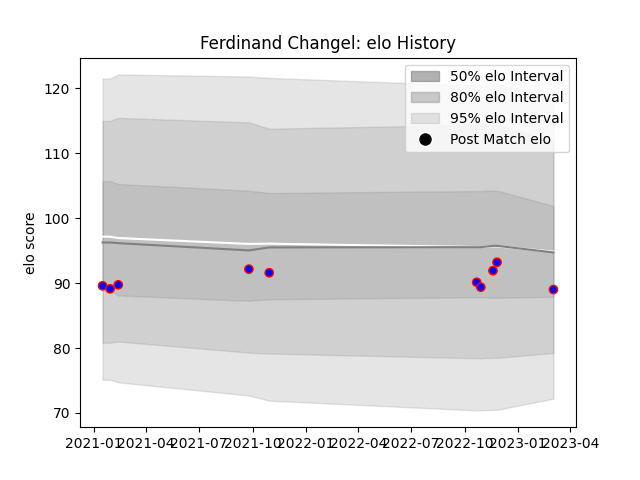

---  
layout: page  
title: Ferdinand Changel  
date: 2023-03-04 11:34:37.831036  
categories: player  
---
# Ferdinand Changel

## Positions: P

## Current elo: 89.0

## Current Percentile: None

# Elo History

# Match History

| Team    |   Appearances |   Win Rate |
|:--------|--------------:|-----------:|
| Beziers |            10 |        0.3 |

| Opponent                   |   Matches |   Win Rate |
|:---------------------------|----------:|-----------:|
| Aurillac                   |         2 |          0 |
| Oyonnax                    |         2 |          0 |
| Grenoble                   |         1 |          0 |
| Mont-de-Marsan             |         1 |          0 |
| Nevers                     |         1 |          1 |
| Rouen                      |         1 |          1 |
| Valence Romans Drome Rugby |         1 |          1 |
| Vannes                     |         1 |          0 |