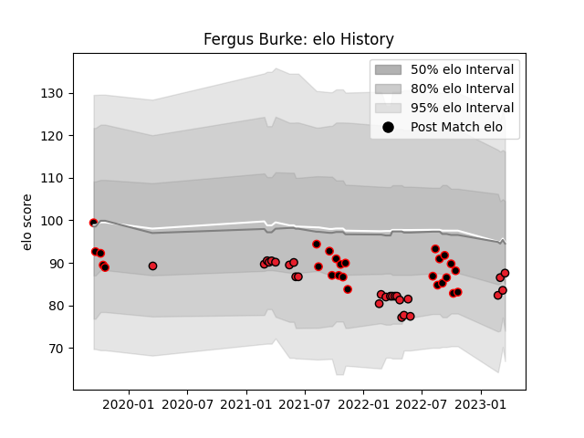

---  
layout: page  
title: Fergus Burke  
date: 2023-03-16 20:00:07.384558  
categories: player  
---
# Fergus Burke

## Positions: FH

## Current elo: 84.0

## Current Percentile: 29.0

# Elo History

# Match History

| Team       |   Appearances |   Win Rate |
|:-----------|--------------:|-----------:|
| Canterbury |            26 |   0.653846 |
| Crusaders  |            25 |   0.76     |

| Opponent                 |   Matches |   Win Rate |
|:-------------------------|----------:|-----------:|
| Highlanders              |         5 |   0.8      |
| Wellington               |         4 |   0.25     |
| Chiefs                   |         4 |   0.5      |
| Otago                    |         3 |   0.666667 |
| Northland                |         3 |   1        |
| Hurricanes               |         3 |   1        |
| Manawatu                 |         3 |   0.666667 |
| New South Wales Waratahs |         2 |   0.5      |
| Bay of Plenty            |         2 |   1        |
| Waikato                  |         2 |   0.5      |
| Tasman                   |         2 |   1        |
| Western Force            |         2 |   1        |
| Melbourne Rebels         |         2 |   1        |
| Hawke's Bay              |         2 |   0.5      |
| Fijian Drua              |         2 |   0.5      |
| Blues                    |         2 |   0.5      |
| North Harbour            |         1 |   1        |
| Queensland Reds          |         1 |   1        |
| Southland                |         1 |   1        |
| Sunwolves                |         1 |   1        |
| Taranaki                 |         1 |   0        |
| Counties Manukau         |         1 |   1        |
| Brumbies                 |         1 |   1        |
| Auckland                 |         1 |   0        |