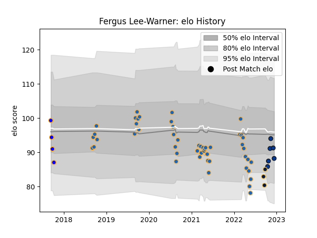

---  
layout: page  
title: Fergus Lee-Warner  
date: 2022-12-14 11:20:04.367522  
categories: player  
---
# Fergus Lee-Warner

## Positions: L, FL

## Current elo: 88.0

## Current Percentile: 32.0

# Elo History

# Match History

| Team                |   Appearances |   Win Rate |
|:--------------------|--------------:|-----------:|
| Western Force       |            49 |   0.367347 |
| Bath Rugby          |             6 |   0.5      |
| Greater Sydney Rams |             4 |   0.25     |
| Worcester Warriors  |             3 |   0.333333 |

| Opponent                 |   Matches |   Win Rate |
|:-------------------------|----------:|-----------:|
| Brumbies                 |         7 |   0        |
| New South Wales Waratahs |         6 |   0.333333 |
| Melbourne Rebels         |         6 |   0.333333 |
| Queensland Reds          |         5 |   0.2      |
| Fijian Drua              |         4 |   0.5      |
| Melbourne Rising         |         3 |   0.666667 |
| Blues                    |         2 |   0        |
| Brisbane City            |         2 |   1        |
| Queensland Country       |         2 |   1        |
| Newcastle Falcons        |         2 |   1        |
| NSW Country Eagles       |         2 |   0.5      |
| Sydney Rays              |         2 |   1        |
| Hurricanes               |         2 |   0.5      |
| Highlanders              |         2 |   0        |
| Crusaders                |         2 |   0        |
| Chiefs                   |         2 |   0        |
| Canberra Vikings         |         2 |   0.5      |
| Leicester Tigers         |         1 |   1        |
| Harlequins               |         1 |   0        |
| Moana Pasifika           |         1 |   1        |
| Glasgow Warriors         |         1 |   0        |
| Exeter Chiefs            |         1 |   0        |
| Northampton Saints       |         1 |   1        |
| Perth Spirit             |         1 |   0        |
| Saracens                 |         1 |   0        |
| London Irish             |         1 |   0        |