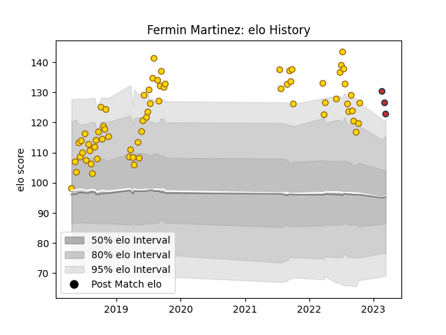

---  
layout: page  
title: Fermin Martinez  
date: 2023-03-21 18:57:34.312480  
categories: player  
---
# Fermin Martinez

Last updated: 2023-03-21
## Positions: C

## Current elo: 126.0

## Current Percentile: 93.0

# Elo History

# Match History

| Team         |   Appearances |   Win Rate |
|:-------------|--------------:|-----------:|
| Belgrano     |            68 |   0.610294 |
| Old Glory DC |             4 |   0.5      |

| Opponent               |   Matches |   Win Rate |
|:-----------------------|----------:|-----------:|
| SIC                    |         7 |   0.285714 |
| Hindu                  |         7 |   0.571429 |
| Regatas Bella Vista    |         7 |   0.571429 |
| Alumni                 |         6 |   0.333333 |
| San Luis               |         6 |   0.583333 |
| CUBA                   |         6 |   0.333333 |
| Pucara                 |         6 |   0.833333 |
| Newman                 |         5 |   0.5      |
| CASI                   |         5 |   0.8      |
| Atlético del Rosario   |         4 |   1        |
| Los Tilos              |         3 |   1        |
| Lomas                  |         2 |   1        |
| San Martin             |         2 |   1        |
| New England Free Jacks |         1 |   0        |
| La Plata               |         1 |   1        |
| Rugby New York         |         1 |   0        |
| Chicago Hounds         |         1 |   1        |
| Buenos Aires           |         1 |   0.5      |
| Toronto Arrows         |         1 |   1        |