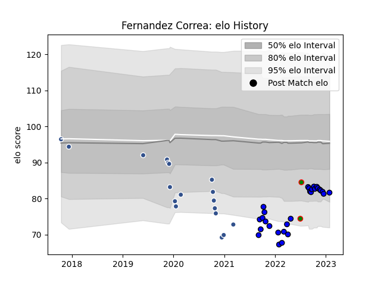

---  
layout: page  
title: Fernandez Correa  
date: 2022-11-22 11:35:15.689454  
categories: player  
---
# Fernandez Correa

## Positions: P

## Country: Senegal

## Current elo: 81.0

## Current Percentile: 7.0

# Elo History

# Match History

| Team    |   Appearances |   Win Rate |
|:--------|--------------:|-----------:|
| Agen    |            18 |   0.111111 |
| Massy   |            18 |   0.5      |
| Senegal |             2 |   0.5      |

| Opponent             |   Matches |   Win Rate |
|:---------------------|----------:|-----------:|
| Soyaux-Angouleme     |         2 |        0.5 |
| Clermont Auvergne    |         2 |        0   |
| Aubenas              |         2 |        1   |
| Wasps                |         2 |        0   |
| Stade Francais Paris |         2 |        0   |
| Bordeaux Begles      |         2 |        0   |
| Edinburgh            |         2 |        0   |
| Racing 92            |         2 |        0   |
| Oyonnax              |         1 |        0   |
| Pau                  |         1 |        0   |
| Provence Rugby       |         1 |        1   |
| Albi                 |         1 |        0   |
| Rouen                |         1 |        0   |
| Montpellier Herault  |         1 |        0   |
| Suresnes             |         1 |        1   |
| Tarbes               |         1 |        1   |
| Nevers               |         1 |        0   |
| Mont-de-Marsan       |         1 |        1   |
| Montauban            |         1 |        0   |
| Algeria              |         1 |        0   |
| London Irish         |         1 |        0   |
| Dax                  |         1 |        1   |
| Carcassonne          |         1 |        1   |
| Burkina Faso         |         1 |        1   |
| Brive                |         1 |        1   |
| Biarritz Olympique   |         1 |        0   |
| Beziers              |         1 |        0   |
| Bayonne              |         1 |        0   |
| Aurillac             |         1 |        0   |
| Zebre                |         1 |        1   |