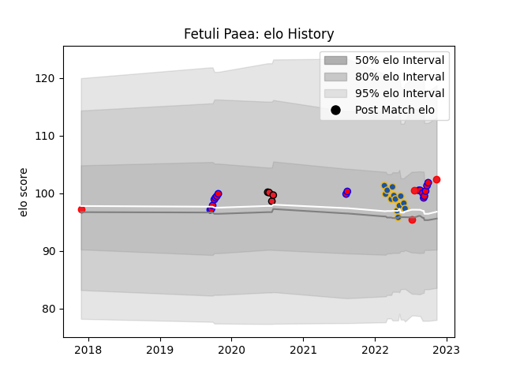

---  
layout: page  
title: Fetuli Paea  
date: 2022-11-22 11:33:39.149999  
categories: player  
---
# Fetuli Paea

## Positions: C, W

## Country: Tonga

## Current elo: 102.0

## Current Percentile: 72.0

# Elo History

# Match History

| Team        |   Appearances |   Win Rate |
|:------------|--------------:|-----------:|
| Tasman      |            17 |   0.705882 |
| Highlanders |            13 |   0.307692 |
| Tonga       |             5 |   0.8      |
| Crusaders   |             4 |   0.75     |

| Opponent         |   Matches |   Win Rate |
|:-----------------|----------:|-----------:|
| Auckland         |         4 |   0.75     |
| Blues            |         3 |   0.333333 |
| Hurricanes       |         3 |   0        |
| Northland        |         2 |   1        |
| Wellington       |         2 |   0.5      |
| Chiefs           |         2 |   0.5      |
| Crusaders        |         2 |   0        |
| Hawke's Bay      |         2 |   0.5      |
| North Harbour    |         2 |   0.5      |
| Waikato          |         1 |   1        |
| Uruguay          |         1 |   1        |
| Taranaki         |         1 |   1        |
| Samoa            |         1 |   0        |
| Romania          |         1 |   1        |
| Queensland Reds  |         1 |   1        |
| Otago            |         1 |   0        |
| Melbourne Rebels |         1 |   0        |
| Moana Pasifika   |         1 |   1        |
| Bay of Plenty    |         1 |   1        |
| Manawatu         |         1 |   1        |
| Hong Kong        |         1 |   1        |
| Highlanders      |         1 |   1        |
| Fijian Drua      |         1 |   1        |
| Chile            |         1 |   1        |
| Brumbies         |         1 |   0        |
| Western Force    |         1 |   1        |