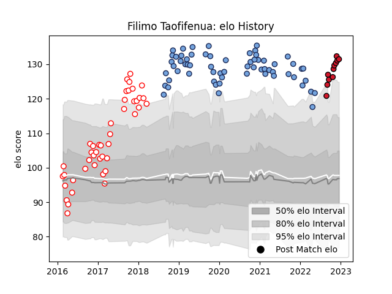

---  
layout: page  
title: Filimo Taofifenua  
date: 2022-12-18 16:25:10.980213  
categories: player  
---
# Filimo Taofifenua

## Positions: FL, N8

## Current elo: 131.0

## Current Percentile: 98.0

# Elo History

# Match History

| Team    |   Appearances |   Win Rate |
|:--------|--------------:|-----------:|
| Bayonne |            63 |   0.468254 |
| Dax     |            44 |   0.409091 |
| Oyonnax |            11 |   0.818182 |

| Opponent             |   Matches |   Win Rate |
|:---------------------|----------:|-----------:|
| Biarritz Olympique   |         7 |   0.285714 |
| Soyaux-Angouleme     |         6 |   0.5      |
| Beziers              |         6 |   0.333333 |
| Nevers               |         6 |   0.583333 |
| Mont-de-Marsan       |         6 |   0.166667 |
| Colomiers            |         5 |   1        |
| Perpignan            |         5 |   0.6      |
| Montauban            |         5 |   0.4      |
| Agen                 |         4 |   0.25     |
| Stade Toulousain     |         4 |   0.5      |
| Narbonne             |         4 |   0.5      |
| Massy                |         4 |   0.75     |
| Carcassonne          |         4 |   0.75     |
| Brive                |         4 |   0.5      |
| Clermont Auvergne    |         3 |   0.333333 |
| Toulon               |         3 |   0.333333 |
| Aurillac             |         3 |   0.666667 |
| Bordeaux Begles      |         3 |   0        |
| Montpellier Herault  |         3 |   0.666667 |
| Vannes               |         3 |   1        |
| Albi                 |         3 |   0.166667 |
| Castres Olympique    |         2 |   0        |
| Provence Rugby       |         2 |   0.5      |
| US Bressane          |         2 |   1        |
| La Rochelle          |         2 |   0.5      |
| Rouen                |         2 |   1        |
| Racing 92            |         2 |   0.5      |
| Pau                  |         2 |   0        |
| Grenoble             |         2 |   0.5      |
| Bourgoin-Jallieu     |         2 |   0.5      |
| Lyon                 |         2 |   0        |
| Oyonnax              |         2 |   0.5      |
| London Irish         |         1 |   1        |
| Bayonne              |         1 |   0.5      |
| Stade Francais Paris |         1 |   1        |
| Leicester Tigers     |         1 |   0        |
| Tarbes               |         1 |   0        |