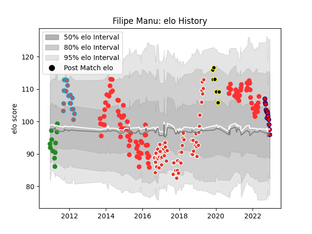

---  
layout: page  
title: Filipe Manu  
date: 2023-03-17 17:07:23.799800  
categories: player  
---
# Filipe Manu

## Positions: N8, FL

## Current elo: 98.0

## Current Percentile: 32.0

# Elo History

# Match History

| Team                       |   Appearances |   Win Rate |
|:---------------------------|--------------:|-----------:|
| Tarbes                     |           115 |   0.508696 |
| Biarritz Olympique         |            81 |   0.58642  |
| Bourgoin-Jallieu           |            23 |   0.478261 |
| Cognac Saint Jean d'Angély |            21 |   0        |
| Saint-Etienne              |            11 |   0        |
| Mont-de-Marsan             |             9 |   0.444444 |

| Opponent                   |   Matches |   Win Rate |
|:---------------------------|----------:|-----------:|
| Dax                        |        17 |   0.529412 |
| Albi                       |        14 |   0.428571 |
| Narbonne                   |        14 |   0.535714 |
| Aurillac                   |        13 |   0.538462 |
| Mont-de-Marsan             |        13 |   0.615385 |
| Colomiers                  |        12 |   0.5      |
| Beziers                    |        12 |   0.583333 |
| Carcassonne                |        12 |   0.583333 |
| Massy                      |        10 |   0.4      |
| Bourgoin-Jallieu           |         9 |   0.555556 |
| Montauban                  |         8 |   0.4375   |
| Soyaux-Angouleme           |         8 |   0.375    |
| Agen                       |         7 |   0.285714 |
| US Bressane                |         7 |   0.285714 |
| Oyonnax                    |         7 |   0.571429 |
| Pau                        |         6 |   0.25     |
| Perpignan                  |         6 |   0.666667 |
| Vannes                     |         6 |   0.333333 |
| Auch                       |         6 |   0.333333 |
| Grenoble                   |         5 |   0.2      |
| Nevers                     |         5 |   0.4      |
| Provence Rugby             |         5 |   0.4      |
| Blagnac                    |         5 |   0.2      |
| Bayonne                    |         5 |   0.8      |
| Chambery                   |         5 |   0.2      |
| Nice                       |         4 |   0.125    |
| Biarritz Olympique         |         4 |   0.5      |
| Cognac Saint Jean d'Angély |         4 |   0.875    |
| Suresnes                   |         4 |   0.25     |
| Lyon                       |         4 |   0.5      |
| Rennes                     |         3 |   0        |
| Tarbes                     |         3 |   0.333333 |
| Aubenas                    |         3 |   0.666667 |
| Valence Romans Drome Rugby |         3 |   0.333333 |
| Carqueiranne-Hyères        |         2 |   0        |
| La Rochelle                |         2 |   0.5      |
| Périgueux                  |         2 |   1        |
| Rouen                      |         2 |   1        |
| Dijon                      |         2 |   0.5      |
| Brive                      |         1 |   0.5      |