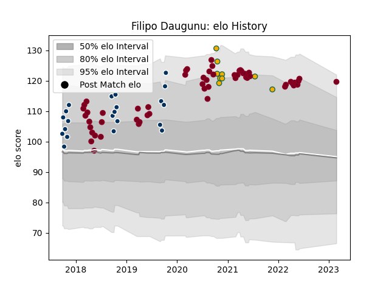

---  
layout: page  
title: Filipo Daugunu  
date: 2023-03-02 11:22:04.598695  
categories: player  
---
# Filipo Daugunu

## Positions: W

## Country: Australia

## Current elo: 120.0

## Current Percentile: 93.0

# Elo History

# Match History

| Team               |   Appearances |   Win Rate |
|:-------------------|--------------:|-----------:|
| Queensland Reds    |            58 |   0.525862 |
| Queensland Country |            21 |   0.666667 |
| Australia          |             9 |   0.388889 |

| Opponent                 |   Matches |   Win Rate |
|:-------------------------|----------:|-----------:|
| Brumbies                 |        11 |   0.636364 |
| Melbourne Rebels         |        10 |   0.75     |
| Western Force            |         6 |   0.5      |
| New South Wales Waratahs |         6 |   0.666667 |
| New Zealand              |         5 |   0.3      |
| Crusaders                |         4 |   0        |
| Fijian Drua              |         4 |   0.5      |
| Hurricanes               |         4 |   0        |
| Blues                    |         3 |   0.333333 |
| Sydney Rays              |         3 |   0.666667 |
| Sunwolves                |         3 |   0.666667 |
| Chiefs                   |         3 |   0.333333 |
| NSW Country Eagles       |         3 |   1        |
| Stormers                 |         2 |   0.5      |
| Argentina                |         2 |   0.5      |
| Highlanders              |         2 |   0        |
| Canberra Vikings         |         2 |   1        |
| Bulls                    |         2 |   1        |
| Brisbane City            |         2 |   0.5      |
| Jaguares                 |         2 |   0.5      |
| Lions                    |         1 |   1        |
| Melbourne Rising         |         1 |   1        |
| Moana Pasifika           |         1 |   1        |
| Greater Sydney Rams      |         1 |   1        |
| France                   |         1 |   1        |
| Fiji                     |         1 |   1        |
| Perth Spirit             |         1 |   0        |
| Sharks                   |         1 |   0        |
| Wales                    |         1 |   0        |