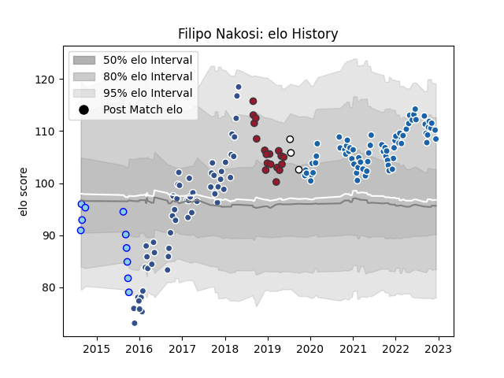

---  
layout: page  
title: Filipo Nakosi  
date: 2023-01-06 00:14:49.675069  
categories: player  
---
# Filipo Nakosi

## Positions: W

## Country: Fiji

## Current elo: 119.0

## Current Percentile: 89.0

# Elo History

# Match History

| Team              |   Appearances |   Win Rate |
|:------------------|--------------:|-----------:|
| Castres Olympique |            72 |   0.590278 |
| Agen              |            57 |   0.45614  |
| Toulon            |            18 |   0.5      |
| Northland         |            11 |   0.181818 |
| Fiji              |             3 |   0.333333 |

| Opponent             |   Matches |   Win Rate |
|:---------------------|----------:|-----------:|
| Stade Toulousain     |        11 |   0.409091 |
| Clermont Auvergne    |         9 |   0.444444 |
| Racing 92            |         9 |   0.388889 |
| Bordeaux Begles      |         9 |   0.166667 |
| Montpellier Herault  |         9 |   0.555556 |
| Pau                  |         8 |   0.875    |
| Lyon                 |         8 |   0.5      |
| La Rochelle          |         7 |   0.428571 |
| Brive                |         7 |   0.714286 |
| Toulon               |         6 |   0.666667 |
| Stade Francais Paris |         6 |   0.666667 |
| Perpignan            |         5 |   0.6      |
| Oyonnax              |         4 |   0.25     |
| Agen                 |         4 |   1        |
| Castres Olympique    |         4 |   0.5      |
| Bayonne              |         3 |   1        |
| Biarritz Olympique   |         3 |   1        |
| Grenoble             |         3 |   0        |
| Carcassonne          |         2 |   1        |
| Vannes               |         2 |   0.75     |
| Bay of Plenty        |         2 |   0.5      |
| Beziers              |         2 |   0        |
| New Zealand Maori    |         2 |   0.5      |
| Narbonne             |         2 |   0.5      |
| Colomiers            |         2 |   0.25     |
| Manawatu             |         2 |   0        |
| Munster              |         2 |   0        |
| London Irish         |         2 |   0        |
| Harlequins           |         2 |   0        |
| Dax                  |         2 |   1        |
| Dragons              |         2 |   0.5      |
| Edinburgh            |         2 |   0        |
| Albi                 |         2 |   0.5      |
| Worcester Warriors   |         2 |   1        |
| Hawke's Bay          |         1 |   0        |
| Newcastle Falcons    |         1 |   1        |
| Bourgoin-Jallieu     |         1 |   1        |
| Exeter Chiefs        |         1 |   0        |
| Mont-de-Marsan       |         1 |   1        |
| Canterbury           |         1 |   0        |
| Southland            |         1 |   0        |
| Montauban            |         1 |   1        |
| Aurillac             |         1 |   1        |
| Taranaki             |         1 |   0        |
| Auckland             |         1 |   0        |
| Uruguay              |         1 |   0        |
| Counties Manukau     |         1 |   0        |
| Wellington           |         1 |   1        |