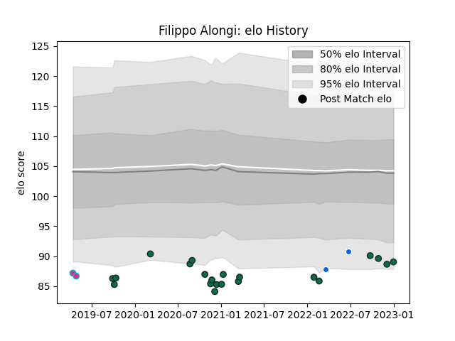

---  
layout: page  
title: Filippo Alongi  
date: 2022-12-12 15:21:59.251193  
categories: player  
---
# Filippo Alongi

## Positions: P

## Country: Italy

## Current elo: 91.0

## Current Percentile: 33.0

# Elo History

# Match History

| Team             |   Appearances |   Win Rate |
|:-----------------|--------------:|-----------:|
| Benetton Treviso |            17 |   0.147059 |
| Italy            |             2 |   1        |
| Zebre            |             2 |   0        |

| Opponent         |   Matches |   Win Rate |
|:-----------------|----------:|-----------:|
| Zebre            |         4 |       0.25 |
| Cardiff Blues    |         2 |       0    |
| Connacht         |         2 |       0    |
| Dragons          |         2 |       0.75 |
| Glasgow Warriors |         2 |       0    |
| Ospreys          |         2 |       0    |
| Scarlets         |         2 |       0    |
| Benetton Treviso |         1 |       0    |
| Leinster         |         1 |       0    |
| Munster          |         1 |       0    |
| Namibia          |         1 |       1    |
| Wales            |         1 |       1    |