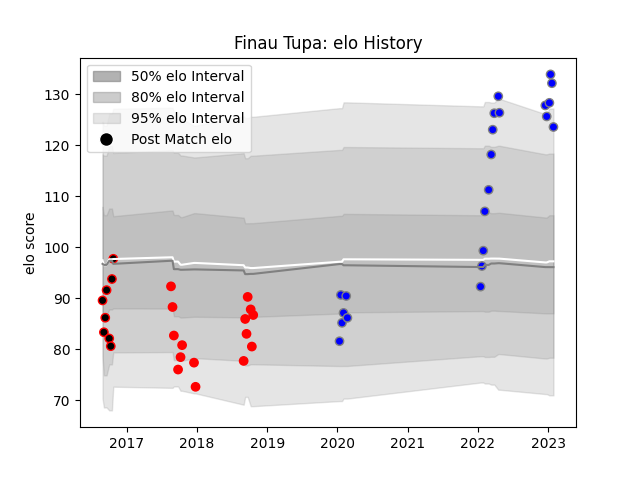

---  
layout: page  
title: Finau Tupa  
date: 2022-12-28 12:56:15.870466  
categories: player  
---
# Finau Tupa

## Positions: FL, N8

## Current elo: 113.0

## Current Percentile: 92.0

# Elo History

# Match History

| Team                              |   Appearances |   Win Rate |
|:----------------------------------|--------------:|-----------:|
| Kubota Spears Funabashi Tokyo-Bay |            18 |       0.75 |
| Yokohama Canon Eagles             |            15 |       0.3  |
| Mie Honda Heat                    |             8 |       0    |

| Opponent                          |   Matches |   Win Rate |
|:----------------------------------|----------:|-----------:|
| Kobelco Kobe Steelers             |         4 |   0.5      |
| Tokyo Sungoliath                  |         4 |   0.25     |
| Toyota Verblitz                   |         4 |   0.25     |
| Green Rockets Tokatsu             |         3 |   0.666667 |
| Munakata Sanix Blues              |         3 |   0.666667 |
| Saitama Wild Knights              |         3 |   0        |
| Shizuoka Blue Revs                |         3 |   0        |
| Toshiba Brave Lupus Tokyo         |         3 |   0.666667 |
| Black Rams Tokyo                  |         2 |   0        |
| Coca-Cola Red Sparks              |         2 |   0.5      |
| Kubota Spears Funabashi Tokyo-Bay |         2 |   0        |
| Mie Honda Heat                    |         2 |   0.75     |
| Urayasu D-Rocks                   |         2 |   1        |
| Yokohama Canon Eagles             |         2 |   0.75     |
| Hino Red Dolphins                 |         1 |   1        |
| NTT Docomo Red Hurricanes Osaka   |         1 |   1        |