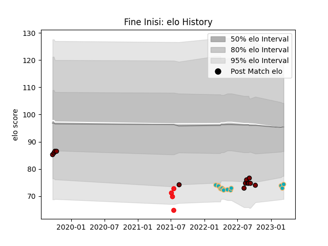

---  
layout: page  
title: Fine Inisi  
date: 2023-03-21 17:59:57.095639  
categories: player  
---
# Fine Inisi

Last updated: 2023-03-21
## Positions: C

## Country: Tonga

## Current elo: 74.0

## Current Percentile: 8.0

# Elo History

# Match History

| Team           |   Appearances |   Win Rate |
|:---------------|--------------:|-----------:|
| Moana Pasifika |            15 |  0.0666667 |
| North Harbour  |            13 |  0.461538  |
| Tonga          |             4 |  0         |

| Opponent                 |   Matches |   Win Rate |
|:-------------------------|----------:|-----------:|
| Chiefs                   |         5 |        0   |
| Samoa                    |         3 |        0   |
| Auckland                 |         2 |        0   |
| Manawatu                 |         2 |        1   |
| Counties Manukau         |         2 |        1   |
| Western Force            |         2 |        0   |
| Canterbury               |         2 |        0   |
| Brumbies                 |         2 |        0.5 |
| Blues                    |         2 |        0   |
| Crusaders                |         1 |        0   |
| Fijian Drua              |         1 |        0   |
| Bay of Plenty            |         1 |        0   |
| Highlanders              |         1 |        0   |
| New South Wales Waratahs |         1 |        0   |
| New Zealand              |         1 |        0   |
| Otago                    |         1 |        0   |
| Tasman                   |         1 |        1   |
| Wellington               |         1 |        1   |
| Hawke's Bay              |         1 |        0   |