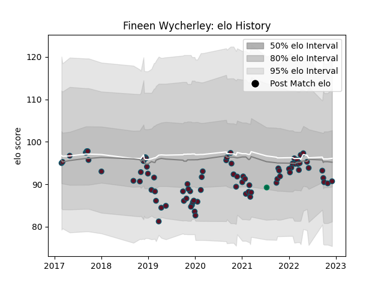

---  
layout: page  
title: Fineen Wycherley  
date: 2023-01-30 11:48:41.239621  
categories: player  
---
# Fineen Wycherley

## Positions: L, FL

## Country: Ireland

## Current elo: 93.0

## Current Percentile: 38.0

# Elo History

# Match History

| Team    |   Appearances |   Win Rate |
|:--------|--------------:|-----------:|
| Munster |            82 |   0.664634 |
| Ireland |             1 |   1        |

| Opponent                 |   Matches |   Win Rate |
|:-------------------------|----------:|-----------:|
| Ulster                   |         9 |   0.333333 |
| Leinster                 |         8 |   0.125    |
| Benetton Treviso         |         6 |   1        |
| Edinburgh                |         6 |   0.833333 |
| Scarlets                 |         6 |   0.666667 |
| Ospreys                  |         6 |   0.833333 |
| Connacht                 |         6 |   0.833333 |
| Glasgow Warriors         |         5 |   0.4      |
| Cardiff Blues            |         5 |   0.8      |
| Zebre                    |         5 |   1        |
| Dragons                  |         4 |   0.75     |
| Castres Olympique        |         3 |   0.666667 |
| Southern Kings           |         3 |   1        |
| Cheetahs                 |         2 |   1        |
| Saracens                 |         2 |   0.5      |
| Lions                    |         1 |   0        |
| Bulls                    |         1 |   0        |
| Racing 92                |         1 |   0.5      |
| Sharks                   |         1 |   1        |
| Stormers                 |         1 |   1        |
| United States of America |         1 |   1        |
| Wasps                    |         1 |   1        |