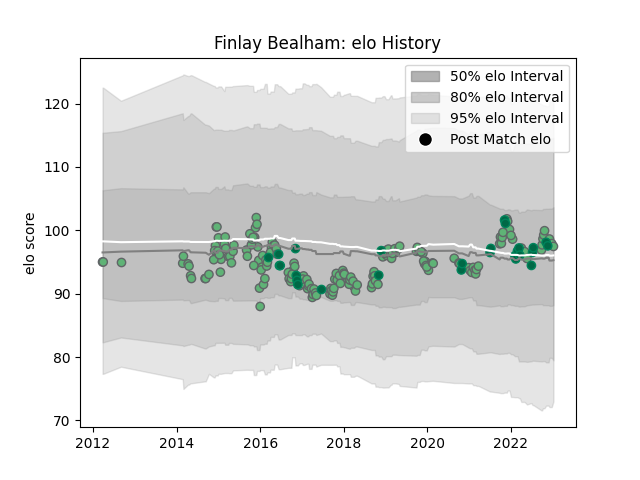

---  
layout: page  
title: Finlay Bealham  
date: 2022-12-12 15:10:55.033886  
categories: player  
---
# Finlay Bealham

## Positions: P

## Country: Ireland

## Current elo: 104.0

## Current Percentile: 76.0

# Elo History

# Match History

| Team     |   Appearances |   Win Rate |
|:---------|--------------:|-----------:|
| Connacht |           175 |   0.485714 |
| Ireland  |            24 |   0.791667 |

| Opponent                 |   Matches |   Win Rate |
|:-------------------------|----------:|-----------:|
| Munster                  |        19 |   0.315789 |
| Ulster                   |        15 |   0.333333 |
| Leinster                 |        13 |   0.230769 |
| Cardiff Blues            |        13 |   0.307692 |
| Zebre                    |        13 |   0.769231 |
| Benetton Treviso         |        12 |   0.916667 |
| Glasgow Warriors         |        11 |   0.272727 |
| Scarlets                 |        10 |   0.4      |
| Ospreys                  |        10 |   0.4      |
| Dragons                  |         9 |   0.777778 |
| Edinburgh                |         9 |   0.555556 |
| Cheetahs                 |         4 |   0.75     |
| Gloucester Rugby         |         4 |   0.25     |
| Stade Toulousain         |         4 |   0.25     |
| Italy                    |         4 |   1        |
| South Africa             |         4 |   0.5      |
| Brive                    |         4 |   0.75     |
| New Zealand              |         4 |   0.75     |
| Wasps                    |         2 |   0.5      |
| United States of America |         2 |   1        |
| Newcastle Falcons        |         2 |   0.5      |
| Southern Kings           |         2 |   1        |
| Sale Sharks              |         2 |   0.5      |
| RC Enisei                |         2 |   1        |
| Bulls                    |         2 |   0.5      |
| Australia                |         2 |   1        |
| Bordeaux Begles          |         2 |   1        |
| Bayonne                  |         2 |   1        |
| Leicester Tigers         |         2 |   0        |
| France                   |         2 |   0        |
| Japan                    |         2 |   1        |
| Stormers                 |         1 |   0        |
| England                  |         1 |   1        |
| Wales                    |         1 |   1        |
| Exeter Chiefs            |         1 |   0        |
| Canada                   |         1 |   1        |
| Grenoble                 |         1 |   0        |
| Oyonnax                  |         1 |   1        |
| Sharks                   |         1 |   0        |
| Scotland                 |         1 |   1        |
| Perpignan                |         1 |   1        |
| La Rochelle              |         1 |   1        |