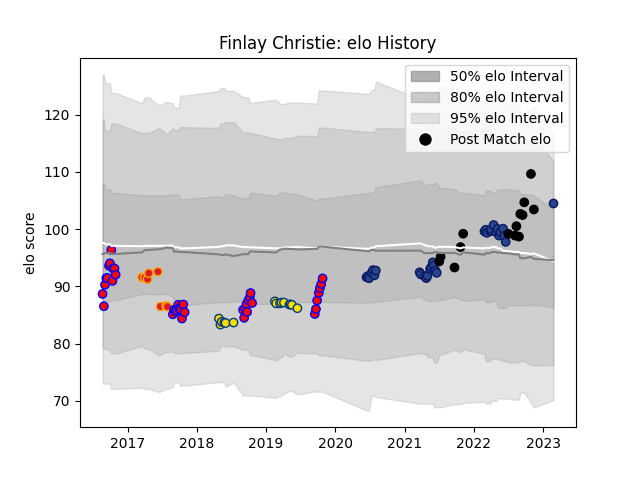

---  
layout: page  
title: Finlay Christie  
date: 2022-11-16 11:26:11.329717  
categories: player  
---
# Finlay Christie

## Positions: SH

## Country: New Zealand

## Current elo: 99.0

## Current Percentile: 69.0

# Elo History

# Match History

| Team        |   Appearances |   Win Rate |
|:------------|--------------:|-----------:|
| Tasman      |            39 |   0.75641  |
| Blues       |            31 |   0.741935 |
| Hurricanes  |            15 |   0.633333 |
| New Zealand |            14 |   0.857143 |
| Chiefs      |             8 |   0.75     |

| Opponent                 |   Matches |   Win Rate |
|:-------------------------|----------:|-----------:|
| Highlanders              |         8 |   0.75     |
| Crusaders                |         8 |   0.125    |
| Chiefs                   |         7 |   0.642857 |
| Taranaki                 |         5 |   0.8      |
| Auckland                 |         5 |   0.8      |
| North Harbour            |         4 |   0.875    |
| Canterbury               |         4 |   0        |
| Melbourne Rebels         |         4 |   1        |
| Hurricanes               |         4 |   0.5      |
| Argentina                |         3 |   0.666667 |
| Wellington               |         3 |   1        |
| Waikato                  |         3 |   1        |
| Otago                    |         3 |   0.666667 |
| Western Force            |         3 |   1        |
| Hawke's Bay              |         3 |   1        |
| Counties Manukau         |         3 |   0.666667 |
| Blues                    |         3 |   1        |
| Brumbies                 |         3 |   1        |
| Australia                |         2 |   1        |
| Manawatu                 |         2 |   0.5      |
| Moana Pasifika           |         2 |   1        |
| New South Wales Waratahs |         2 |   1        |
| Northland                |         2 |   1        |
| Queensland Reds          |         2 |   1        |
| South Africa             |         2 |   0.5      |
| Southland                |         2 |   1        |
| Stormers                 |         2 |   1        |
| Jaguares                 |         1 |   0        |
| Sunwolves                |         1 |   1        |
| Ireland                  |         1 |   1        |
| United States of America |         1 |   1        |
| Tonga                    |         1 |   1        |
| British and Irish Lions  |         1 |   0        |
| Scotland                 |         1 |   1        |
| Japan                    |         1 |   1        |
| Fiji                     |         1 |   1        |
| Bulls                    |         1 |   1        |
| Cheetahs                 |         1 |   1        |
| Italy                    |         1 |   1        |
| Lions                    |         1 |   1        |