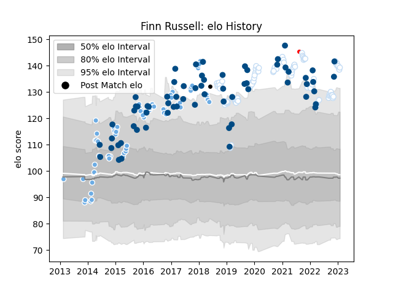

---  
layout: page  
title: Finn Russell  
date: 2022-11-22 11:28:38.702128  
categories: player  
---
# Finn Russell

## Positions: FH

## Country: Scotland

## Current elo: 126.0

## Current Percentile: 94.0

# Elo History

# Match History

| Team                    |   Appearances |   Win Rate |
|:------------------------|--------------:|-----------:|
| Glasgow Warriors        |            82 |   0.621951 |
| Racing 92               |            81 |   0.648148 |
| Scotland                |            65 |   0.576923 |
| British and Irish Lions |             3 |   0.5      |
| Barbarians              |             1 |   1        |

| Opponent                 |   Matches |   Win Rate |
|:-------------------------|----------:|-----------:|
| Montpellier Herault      |        10 |   0.7      |
| Munster                  |        10 |   0.65     |
| Ulster                   |         9 |   0.555556 |
| Connacht                 |         8 |   0.75     |
| Wales                    |         8 |   0.25     |
| France                   |         8 |   0.5      |
| Stade Toulousain         |         8 |   0.375    |
| England                  |         8 |   0.5625   |
| Edinburgh                |         8 |   0.375    |
| Scarlets                 |         8 |   0.75     |
| Italy                    |         7 |   1        |
| Ireland                  |         7 |   0.142857 |
| Clermont Auvergne        |         7 |   0.714286 |
| Stade Francais Paris     |         6 |   0.666667 |
| Bordeaux Begles          |         6 |   0.166667 |
| Benetton Treviso         |         6 |   1        |
| Lyon                     |         6 |   0.5      |
| La Rochelle              |         6 |   0.333333 |
| Cardiff Blues            |         5 |   1        |
| Ospreys                  |         5 |   1        |
| Toulon                   |         5 |   0.6      |
| Australia                |         5 |   0.6      |
| Racing 92                |         4 |   0.75     |
| Leicester Tigers         |         4 |   1        |
| Saracens                 |         4 |   0.5      |
| Perpignan                |         4 |   1        |
| Pau                      |         4 |   0.75     |
| Leinster                 |         4 |   0        |
| Zebre                    |         4 |   1        |
| Argentina                |         4 |   1        |
| Japan                    |         3 |   0.666667 |
| Dragons                  |         3 |   0.333333 |
| Brive                    |         3 |   1        |
| South Africa             |         3 |   0        |
| Castres Olympique        |         3 |   1        |
| Samoa                    |         3 |   1        |
| Agen                     |         3 |   1        |
| Exeter Chiefs            |         3 |   0.333333 |
| New Zealand              |         3 |   0        |
| Georgia                  |         3 |   1        |
| Northampton Saints       |         2 |   0        |
| United States of America |         2 |   1        |
| Bath Rugby               |         2 |   0.5      |
| Chiefs                   |         1 |   1        |
| Fiji                     |         1 |   1        |
| Canada                   |         1 |   1        |
| Hurricanes               |         1 |   0.5      |
| Tonga                    |         1 |   1        |
| Biarritz Olympique       |         1 |   0        |
| Bayonne                  |         1 |   0        |
| Cheetahs                 |         1 |   1        |