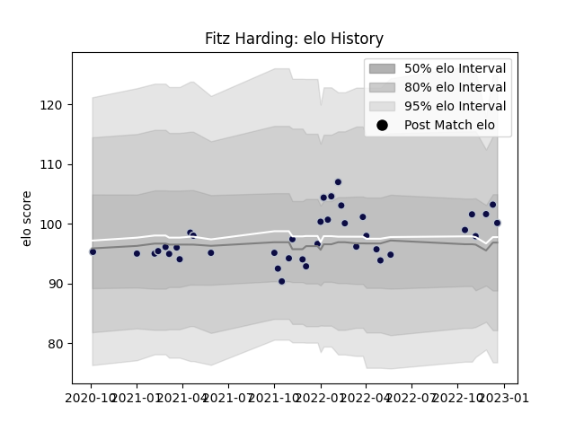

---  
layout: page  
title: Fitz Harding  
date: 2022-12-14 11:17:12.274277  
categories: player  
---
# Fitz Harding

## Positions: N8, FL

## Current elo: 103.0

## Current Percentile: 70.0

# Elo History

# Match History

| Team          |   Appearances |   Win Rate |
|:--------------|--------------:|-----------:|
| Bristol Rugby |            37 |   0.486486 |

| Opponent             |   Matches |   Win Rate |
|:---------------------|----------:|-----------:|
| Gloucester Rugby     |         4 |   0.5      |
| Newcastle Falcons    |         4 |   0.75     |
| Northampton Saints   |         4 |   0.25     |
| Sale Sharks          |         4 |   0.25     |
| Exeter Chiefs        |         3 |   0.333333 |
| Harlequins           |         3 |   0.333333 |
| Leicester Tigers     |         3 |   0.333333 |
| London Irish         |         3 |   0.666667 |
| Worcester Warriors   |         3 |   0.666667 |
| Saracens             |         2 |   0        |
| Bath Rugby           |         1 |   1        |
| Perpignan            |         1 |   1        |
| Scarlets             |         1 |   1        |
| Stade Francais Paris |         1 |   1        |