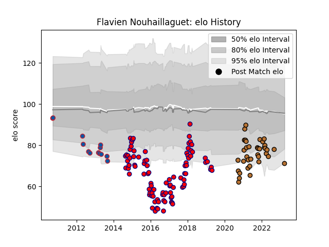

---  
layout: page  
title: Flavien Nouhaillaguet  
date: 2023-03-27 11:33:22.613461  
categories: player  
---
# Flavien Nouhaillaguet

Last updated: 2023-03-27
## Positions: N8, FL

## Current elo: 71.0

## Current Percentile: 9.0

# Elo History

# Match History

| Team     |   Appearances |   Win Rate |
|:---------|--------------:|-----------:|
| Aurillac |            91 |   0.483516 |
| Narbonne |            37 |   0.527027 |
| Grenoble |            13 |   0.192308 |

| Opponent                   |   Matches |   Win Rate |
|:---------------------------|----------:|-----------:|
| Beziers                    |         9 |   0.555556 |
| Perpignan                  |         9 |   0.388889 |
| Colomiers                  |         8 |   0.375    |
| Bayonne                    |         7 |   0.142857 |
| Biarritz Olympique         |         7 |   0.571429 |
| Narbonne                   |         7 |   0.571429 |
| Dax                        |         7 |   0.285714 |
| Agen                       |         5 |   0.6      |
| Tarbes                     |         5 |   0.8      |
| Mont-de-Marsan             |         5 |   0.4      |
| Albi                       |         5 |   0.4      |
| Massy                      |         5 |   0.6      |
| Vannes                     |         5 |   0.2      |
| Carcassonne                |         5 |   0.2      |
| Bourgoin-Jallieu           |         5 |   0.7      |
| Grenoble                   |         4 |   0.375    |
| Montauban                  |         4 |   0.75     |
| Nevers                     |         4 |   0.25     |
| Nice                       |         3 |   1        |
| US Bressane                |         3 |   0.333333 |
| Soyaux-Angouleme           |         3 |   0.666667 |
| Provence Rugby             |         3 |   0.666667 |
| Cognac Saint Jean d'Angély |         3 |   1        |
| Oyonnax                    |         3 |   0        |
| Blagnac                    |         2 |   1        |
| Dijon                      |         2 |   0.5      |
| Castres Olympique          |         2 |   0        |
| Suresnes                   |         2 |   0.5      |
| Aubenas                    |         2 |   0.5      |
| Bordeaux Begles            |         1 |   0.5      |
| Pau                        |         1 |   0        |
| Rouen                      |         1 |   1        |
| Stade Toulousain           |         1 |   0        |
| Toulon                     |         1 |   1        |
| Chambery                   |         1 |   0        |
| Clermont Auvergne          |         1 |   0        |