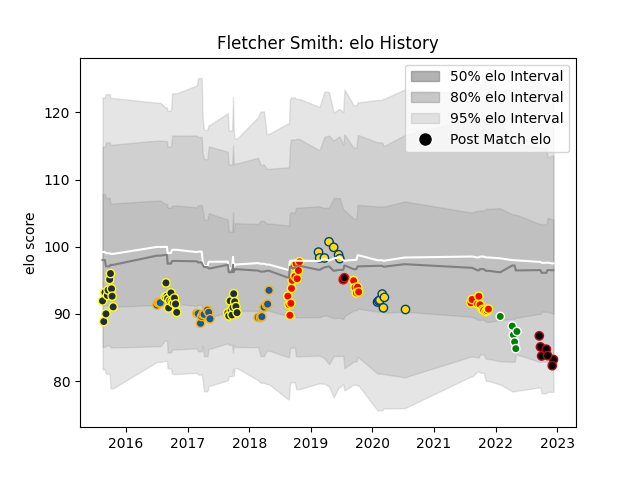

---  
layout: page  
title: Fletcher Smith  
date: 2022-12-09 13:22:20.593800  
categories: player  
---
# Fletcher Smith

## Positions: FH, FB

## Country: New Zealand Maori

## Current elo: 82.0

## Current Percentile: 11.0

# Elo History

# Match History

| Team                  |   Appearances |   Win Rate |
|:----------------------|--------------:|-----------:|
| Otago                 |            33 |   0.545455 |
| Waikato               |            27 |   0.555556 |
| Highlanders           |            20 |   0.8      |
| Hurricanes            |            14 |   0.714286 |
| Green Rockets Tokatsu |             6 |   0        |
| Lyon                  |             6 |   0.333333 |
| New Zealand Maori     |             2 |   0.5      |

| Opponent                          |   Matches |   Win Rate |
|:----------------------------------|----------:|-----------:|
| Wellington                        |         7 |   0.571429 |
| Tasman                            |         6 |   0.5      |
| Northland                         |         6 |   0.666667 |
| Bay of Plenty                     |         6 |   0.666667 |
| Blues                             |         5 |   0.8      |
| Canterbury                        |         5 |   0.2      |
| North Harbour                     |         5 |   0.6      |
| Hawke's Bay                       |         5 |   0.4      |
| Auckland                          |         4 |   0.25     |
| Taranaki                          |         4 |   0.75     |
| Stormers                          |         4 |   0.75     |
| Southland                         |         4 |   1        |
| Chiefs                            |         4 |   0.5      |
| Otago                             |         4 |   0.5      |
| Jaguares                          |         3 |   0.666667 |
| Manawatu                          |         3 |   0.666667 |
| Brumbies                          |         3 |   1        |
| Crusaders                         |         3 |   0.333333 |
| Bulls                             |         3 |   1        |
| Kubota Spears Funabashi Tokyo-Bay |         2 |   0        |
| Fiji                              |         2 |   0.5      |
| Sunwolves                         |         2 |   1        |
| Hurricanes                        |         1 |   0        |
| Southern Kings                    |         1 |   1        |
| Bayonne                           |         1 |   0        |
| Urayasu D-Rocks                   |         1 |   0        |
| Castres Olympique                 |         1 |   1        |
| Stade Francais Paris              |         1 |   1        |
| Cheetahs                          |         1 |   1        |
| Saitama Wild Knights              |         1 |   0        |
| Sharks                            |         1 |   1        |
| Highlanders                       |         1 |   1        |
| Racing 92                         |         1 |   0        |
| Perpignan                         |         1 |   0        |
| Clermont Auvergne                 |         1 |   0        |
| Counties Manukau                  |         1 |   0        |
| New South Wales Waratahs          |         1 |   1        |
| Melbourne Rebels                  |         1 |   1        |
| Kobelco Kobe Steelers             |         1 |   0        |
| Yokohama Canon Eagles             |         1 |   0        |