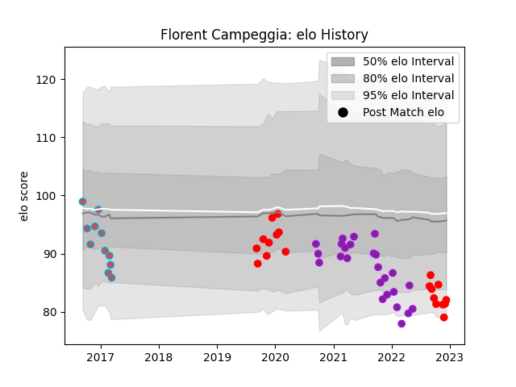

---  
layout: page  
title: Florent Campeggia  
date: 2022-11-22 11:36:30.512660  
categories: player  
---
# Florent Campeggia

## Positions: SH

## Current elo: 80.0

## Current Percentile: 10.0

# Elo History

# Match History

| Team             |   Appearances |   Win Rate |
|:-----------------|--------------:|-----------:|
| US Bressane      |            25 |   0.6      |
| Rouen            |            17 |   0.470588 |
| Bourgoin-Jallieu |            11 |   0.181818 |

| Opponent           |   Matches |   Win Rate |
|:-------------------|----------:|-----------:|
| Aurillac           |         4 |   0.5      |
| Agen               |         3 |   0.333333 |
| Beziers            |         3 |   0.666667 |
| Soyaux-Angouleme   |         3 |   0.333333 |
| Carcassonne        |         3 |   0.333333 |
| Colomiers          |         3 |   0.333333 |
| Nevers             |         3 |   0        |
| Mont-de-Marsan     |         2 |   0        |
| Tarbes             |         2 |   0.5      |
| Roval Drome XV     |         2 |   1        |
| Rouen              |         2 |   0.75     |
| Oyonnax            |         2 |   0        |
| Narbonne           |         2 |   0.5      |
| Montauban          |         2 |   0.5      |
| Massy              |         2 |   1        |
| Albi               |         2 |   0.5      |
| Biarritz Olympique |         2 |   0        |
| Vannes             |         2 |   1        |
| Grenoble           |         1 |   0        |
| Dax                |         1 |   1        |
| Nice               |         1 |   0        |
| Chambery           |         1 |   1        |
| Provence Rugby     |         1 |   0.5      |
| Bourgoin-Jallieu   |         1 |   1        |
| Blagnac            |         1 |   1        |
| Suresnes           |         1 |   1        |
| Bayonne            |         1 |   0        |