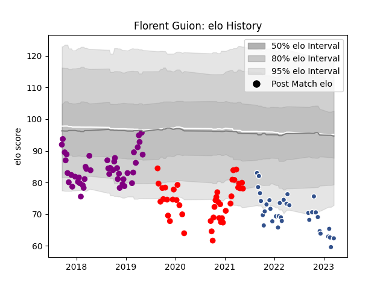

---  
layout: page  
title: Florent Guion  
date: 2022-12-09 13:22:34.435089  
categories: player  
---
# Florent Guion

## Positions: P

## Current elo: 70.0

## Current Percentile: 2.0

# Elo History

# Match History

| Team             |   Appearances |   Win Rate |
|:-----------------|--------------:|-----------:|
| Rouen            |            29 |   0.344828 |
| Soyaux-Angouleme |            25 |   0.34     |
| Agen             |            21 |   0.428571 |

| Opponent           |   Matches |   Win Rate |
|:-------------------|----------:|-----------:|
| Mont-de-Marsan     |         8 |   0.125    |
| Colomiers          |         7 |   0.285714 |
| Aurillac           |         7 |   0.571429 |
| Beziers            |         6 |   0.333333 |
| Montauban          |         6 |   0.166667 |
| Oyonnax            |         5 |   0.2      |
| Narbonne           |         4 |   0.5      |
| Carcassonne        |         4 |   0.5      |
| Soyaux-Angouleme   |         4 |   0.5      |
| US Bressane        |         3 |   0        |
| Grenoble           |         3 |   0.333333 |
| Provence Rugby     |         3 |   0.666667 |
| Nevers             |         3 |   0.333333 |
| Perpignan          |         2 |   0.75     |
| Roval Drome XV     |         2 |   1        |
| Biarritz Olympique |         2 |   0        |
| Vannes             |         2 |   0.5      |
| Brive              |         1 |   0        |
| Bayonne            |         1 |   0        |
| Massy              |         1 |   1        |
| Dax                |         1 |   1        |