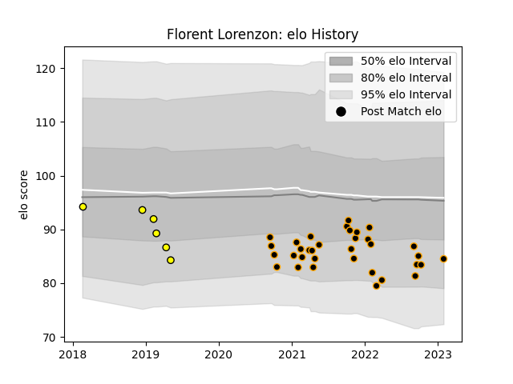

---  
layout: page  
title: Florent Lorenzon  
date: 2023-02-02 19:01:16.146561  
categories: player  
---
# Florent Lorenzon

## Positions: P

## Current elo: 85.0

## Current Percentile: 15.0

# Elo History

# Match History

| Team        |   Appearances |   Win Rate |
|:------------|--------------:|-----------:|
| Chambery    |            34 |   0.397059 |
| Carcassonne |             6 |   0.166667 |

| Opponent                   |   Matches |   Win Rate |
|:---------------------------|----------:|-----------:|
| Massy                      |         3 |   0.5      |
| Dijon                      |         3 |   0.333333 |
| US Bressane                |         3 |   0        |
| Blagnac                    |         3 |   0.333333 |
| Bourgoin-Jallieu           |         3 |   0.333333 |
| Tarbes                     |         3 |   0.666667 |
| Aubenas                    |         3 |   0.333333 |
| Dax                        |         3 |   0        |
| Suresnes                   |         2 |   1        |
| Albi                       |         2 |   0        |
| Cognac Saint Jean d'Angély |         2 |   1        |
| Valence Romans Drome Rugby |         2 |   0        |
| Colomiers                  |         1 |   1        |
| Mont-de-Marsan             |         1 |   0        |
| Narbonne                   |         1 |   1        |
| Nice                       |         1 |   0        |
| Oyonnax                    |         1 |   0        |
| Soyaux-Angouleme           |         1 |   1        |
| Brive                      |         1 |   0        |
| Bayonne                    |         1 |   0        |