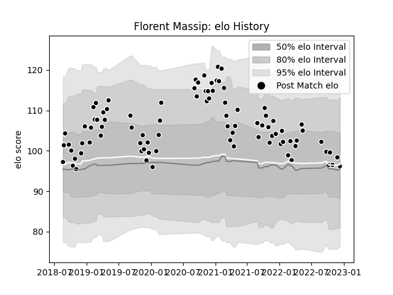

---  
layout: page  
title: Florent Massip  
date: 2023-01-13 11:35:20.138129  
categories: player  
---
# Florent Massip

## Positions: FB

## Current elo: 100.0

## Current Percentile: 69.0

# Elo History

# Match History

| Team           |   Appearances |   Win Rate |
|:---------------|--------------:|-----------:|
| Provence Rugby |            99 |   0.535354 |

| Opponent                   |   Matches |   Win Rate |
|:---------------------------|----------:|-----------:|
| Oyonnax                    |         8 |   0.3125   |
| Montauban                  |         7 |   0.714286 |
| Carcassonne                |         7 |   0.571429 |
| Aurillac                   |         7 |   0.571429 |
| Grenoble                   |         7 |   0.642857 |
| Vannes                     |         7 |   0.571429 |
| Mont-de-Marsan             |         6 |   0.666667 |
| Nevers                     |         6 |   0.666667 |
| Biarritz Olympique         |         5 |   0.3      |
| Beziers                    |         5 |   0.4      |
| Rouen                      |         5 |   0.6      |
| Soyaux-Angouleme           |         5 |   0.2      |
| Colomiers                  |         4 |   0.5      |
| US Bressane                |         4 |   0.625    |
| Massy                      |         3 |   0.333333 |
| Bayonne                    |         3 |   0.666667 |
| Perpignan                  |         3 |   0.333333 |
| Roval Drome XV             |         2 |   1        |
| Valence Romans Drome Rugby |         2 |   1        |
| Brive                      |         1 |   1        |
| Narbonne                   |         1 |   0        |
| Agen                       |         1 |   0        |