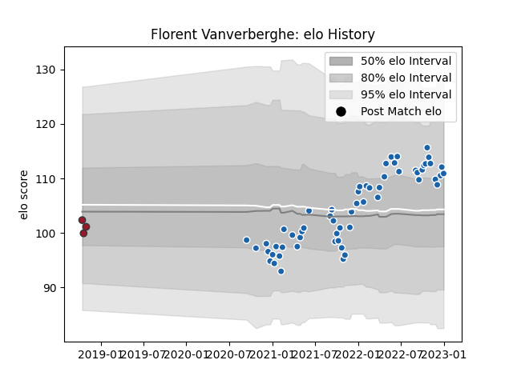

---  
layout: page  
title: Florent Vanverberghe  
date: 2023-01-06 00:25:03.103569  
categories: player  
---
# Florent Vanverberghe

## Positions: L

## Current elo: 111.0

## Current Percentile: 70.0

# Elo History

# Match History

| Team              |   Appearances |   Win Rate |
|:------------------|--------------:|-----------:|
| Castres Olympique |            58 |   0.586207 |
| Toulon            |             3 |   0        |

| Opponent             |   Matches |   Win Rate |
|:---------------------|----------:|-----------:|
| Lyon                 |         5 |   0.6      |
| Montpellier Herault  |         5 |   0.6      |
| Stade Toulousain     |         5 |   0.6      |
| Stade Francais Paris |         5 |   0.4      |
| Pau                  |         5 |   1        |
| Toulon               |         5 |   0.6      |
| La Rochelle          |         4 |   0.25     |
| Racing 92            |         4 |   0.375    |
| Bayonne              |         3 |   1        |
| Clermont Auvergne    |         3 |   1        |
| Brive                |         3 |   0.333333 |
| Perpignan            |         3 |   0.666667 |
| Bordeaux Begles      |         3 |   0.166667 |
| Edinburgh            |         2 |   0        |
| Biarritz Olympique   |         2 |   1        |
| Harlequins           |         1 |   0        |
| Newcastle Falcons    |         1 |   0        |
| Ospreys              |         1 |   0        |
| Agen                 |         1 |   1        |