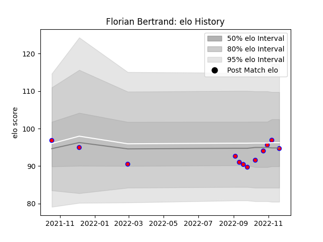

---  
layout: page  
title: Florian Bertrand  
date: 2023-01-15 11:46:58.776578  
categories: player  
---
# Florian Bertrand

## Positions: H, N8

## Current elo: 90.0

## Current Percentile: 41.0

# Elo History

# Match History

| Team    |   Appearances |   Win Rate |
|:--------|--------------:|-----------:|
| Blagnac |            32 |   0.484375 |

| Opponent                   |   Matches |   Win Rate |
|:---------------------------|----------:|-----------:|
| Albi                       |         3 |   0.333333 |
| Bourgoin-Jallieu           |         3 |   0.666667 |
| Chambery                   |         3 |   0.666667 |
| Dax                        |         3 |   0.333333 |
| Suresnes                   |         3 |   0.666667 |
| Valence Romans Drome Rugby |         3 |   0.333333 |
| Aubenas                    |         2 |   1        |
| Nice                       |         2 |   0        |
| Soyaux-Angouleme           |         2 |   0        |
| Tarbes                     |         2 |   1        |
| Carqueiranne-Hyères        |         1 |   1        |
| Cognac Saint Jean d'Angély |         1 |   0        |
| Dijon                      |         1 |   0        |
| Narbonne                   |         1 |   0.5      |
| Rennes                     |         1 |   1        |
| US Bressane                |         1 |   0        |