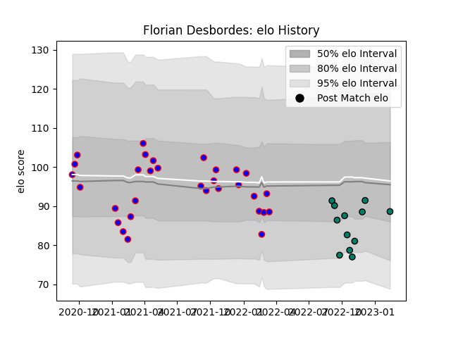

---  
layout: page  
title: Florian Desbordes  
date: 2023-03-17 17:02:47.778555  
categories: player  
---
# Florian Desbordes

## Positions: L, FL

## Current elo: 83.0

## Current Percentile: 24.0

# Elo History

# Match History

| Team     |   Appearances |   Win Rate |
|:---------|--------------:|-----------:|
| Dijon    |            31 |   0.403226 |
| Suresnes |            15 |   0.466667 |

| Opponent                   |   Matches |   Win Rate |
|:---------------------------|----------:|-----------:|
| Albi                       |         5 |   0.2      |
| Bourgoin-Jallieu           |         5 |   0.4      |
| Dax                        |         4 |   0        |
| Cognac Saint Jean d'Angély |         4 |   0.25     |
| Tarbes                     |         3 |   0.833333 |
| Nice                       |         3 |   0.333333 |
| Aubenas                    |         3 |   0.666667 |
| Massy                      |         3 |   0.333333 |
| Chambery                   |         3 |   1        |
| Valence Romans Drome Rugby |         3 |   0.333333 |
| Narbonne                   |         2 |   0        |
| Soyaux-Angouleme           |         2 |   0.5      |
| Blagnac                    |         2 |   0.5      |
| Carqueiranne-Hyères        |         1 |   1        |
| Rennes                     |         1 |   1        |
| Suresnes                   |         1 |   1        |
| US Bressane                |         1 |   0        |