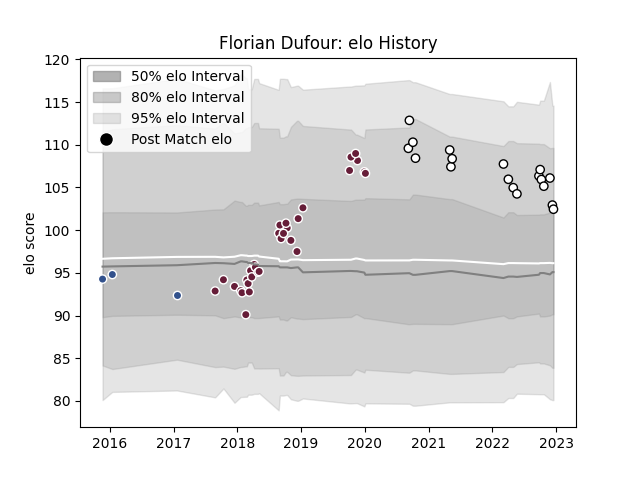

---  
layout: page  
title: Florian Dufour  
date: 2022-12-18 16:34:40.014760  
categories: player  
---
# Florian Dufour

## Positions: H

## Current elo: 102.0

## Current Percentile: 84.0

# Elo History

# Match History

| Team            |   Appearances |   Win Rate |
|:----------------|--------------:|-----------:|
| Bordeaux Begles |            31 |   0.467742 |
| Brive           |            18 |   0.166667 |
| Agen            |             3 |   0        |

| Opponent             |   Matches |   Win Rate |
|:---------------------|----------:|-----------:|
| Clermont Auvergne    |         6 |       0.5  |
| Pau                  |         5 |       0.8  |
| Stade Toulousain     |         4 |       0    |
| Bayonne              |         3 |       1    |
| Stade Francais Paris |         3 |       0    |
| Agen                 |         2 |       1    |
| Toulon               |         2 |       0    |
| Sale Sharks          |         2 |       0.5  |
| RC Enisei            |         2 |       1    |
| Perpignan            |         2 |       0.5  |
| Montpellier Herault  |         2 |       0.25 |
| Lyon                 |         2 |       0    |
| La Rochelle          |         2 |       0    |
| Edinburgh            |         2 |       0    |
| Connacht             |         2 |       0    |
| Castres Olympique    |         2 |       0    |
| Grenoble             |         1 |       0    |
| Oyonnax              |         1 |       0    |
| Dragons              |         1 |       0    |
| Racing 92            |         1 |       0    |
| Cardiff Blues        |         1 |       0    |
| Brive                |         1 |       0    |
| Bordeaux Begles      |         1 |       0    |
| Biarritz Olympique   |         1 |       0    |
| Wasps                |         1 |       1    |