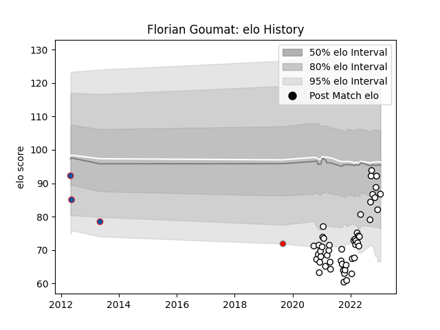

---  
layout: page  
title: Florian Goumat  
date: 2022-11-22 11:27:32.317778  
categories: player  
---
# Florian Goumat

## Positions: L

## Current elo: 90.0

## Current Percentile: 33.0

# Elo History

# Match History

| Team                       |   Appearances |   Win Rate |
|:---------------------------|--------------:|-----------:|
| Valence Romans Drome Rugby |            31 |        0.5 |
| Grenoble                   |             2 |        0   |
| Roval Drome XV             |             1 |        0   |

| Opponent                   |   Matches |   Win Rate |
|:---------------------------|----------:|-----------:|
| Soyaux-Angouleme           |         4 |   0.375    |
| Dax                        |         3 |   0.333333 |
| Oyonnax                    |         3 |   0        |
| Tarbes                     |         2 |   0.5      |
| Suresnes                   |         2 |   1        |
| Cognac Saint Jean d'Angély |         2 |   1        |
| Rouen                      |         2 |   0.5      |
| Nice                       |         1 |   1        |
| Stade Toulousain           |         1 |   0        |
| Rennes                     |         1 |   1        |
| Provence Rugby             |         1 |   0        |
| Perpignan                  |         1 |   0        |
| Albi                       |         1 |   0        |
| Narbonne                   |         1 |   1        |
| Aubenas                    |         1 |   1        |
| Massy                      |         1 |   0        |
| Grenoble                   |         1 |   0        |
| Dijon                      |         1 |   1        |
| Colomiers                  |         1 |   0        |
| Carqueiranne-Hyères        |         1 |   1        |
| Blagnac                    |         1 |   1        |
| Aurillac                   |         1 |   0        |
| Mont-de-Marsan             |         1 |   0        |