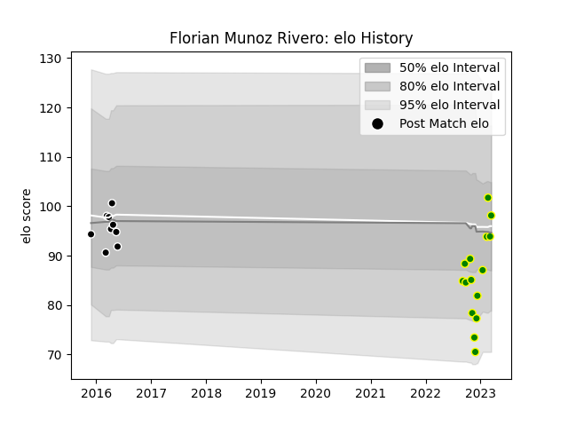

---  
layout: page  
title: Florian Munoz Rivero  
date: 2023-03-21 18:32:37.144658  
categories: player  
---
# Florian Munoz Rivero

Last updated: 2023-03-21
## Positions: FL

## Current elo: 98.0

## Current Percentile: 45.0

# Elo History

# Match History

| Team                |   Appearances |   Win Rate |
|:--------------------|--------------:|-----------:|
| Carqueiranne-Hyères |            15 |   0.4      |
| Provence Rugby      |             9 |   0.333333 |

| Opponent                   |   Matches |   Win Rate |
|:---------------------------|----------:|-----------:|
| Albi                       |         2 |        1   |
| Narbonne                   |         2 |        0.5 |
| Bourgoin-Jallieu           |         2 |        0.5 |
| Chambery                   |         2 |        0.5 |
| Cognac Saint Jean d'Angély |         2 |        1   |
| US Bressane                |         1 |        1   |
| Tarbes                     |         1 |        0   |
| Suresnes                   |         1 |        1   |
| Rennes                     |         1 |        0   |
| Perpignan                  |         1 |        0   |
| Nice                       |         1 |        0   |
| Dax                        |         1 |        0   |
| Montauban                  |         1 |        0   |
| Aurillac                   |         1 |        0   |
| Colomiers                  |         1 |        0   |
| Blagnac                    |         1 |        0   |
| Biarritz Olympique         |         1 |        0   |
| Bayonne                    |         1 |        0   |
| Valence Romans Drome Rugby |         1 |        0   |