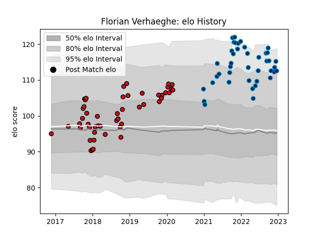

---  
layout: page  
title: Florian Verhaeghe  
date: 2022-12-18 16:32:54.898347  
categories: player  
---
# Florian Verhaeghe

## Positions: L

## Country: France

## Current elo: 113.0

## Current Percentile: 92.0

# Elo History

# Match History

| Team                |   Appearances |   Win Rate |
|:--------------------|--------------:|-----------:|
| Stade Toulousain    |            49 |   0.683673 |
| Montpellier Herault |            40 |   0.5625   |
| France              |             1 |   1        |

| Opponent             |   Matches |   Win Rate |
|:---------------------|----------:|-----------:|
| Bordeaux Begles      |         8 |   0.75     |
| Pau                  |         6 |   0.666667 |
| Castres Olympique    |         6 |   0.5      |
| Lyon                 |         6 |   0.416667 |
| La Rochelle          |         6 |   0.5      |
| Clermont Auvergne    |         5 |   0.4      |
| Stade Toulousain     |         5 |   0.2      |
| Brive                |         5 |   0.8      |
| Toulon               |         5 |   0.7      |
| Bayonne              |         5 |   0.6      |
| Racing 92            |         4 |   0.5      |
| Montpellier Herault  |         4 |   0.5      |
| Agen                 |         4 |   1        |
| Cardiff Blues        |         2 |   0        |
| Oyonnax              |         2 |   0.75     |
| Gloucester Rugby     |         2 |   1        |
| Stade Francais Paris |         2 |   1        |
| Sale Sharks          |         2 |   0.75     |
| Perpignan            |         2 |   1        |
| Leinster             |         1 |   1        |
| Ospreys              |         1 |   0        |
| London Irish         |         1 |   1        |
| Bath Rugby           |         1 |   1        |
| Japan                |         1 |   1        |
| Grenoble             |         1 |   1        |
| Connacht             |         1 |   1        |
| Biarritz Olympique   |         1 |   1        |
| Wasps                |         1 |   1        |