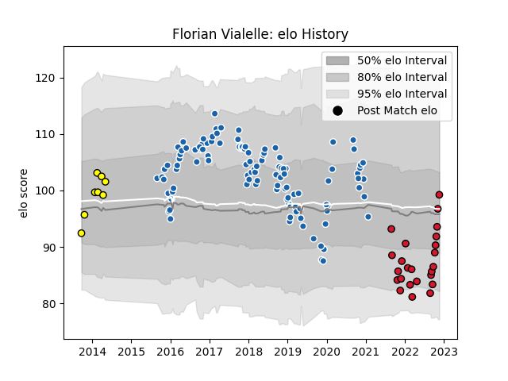

---  
layout: page  
title: Florian Vialelle  
date: 2023-03-21 18:55:44.658263  
categories: player  
---
# Florian Vialelle

Last updated: 2023-03-21
## Positions: C

## Current elo: 104.0

## Current Percentile: 78.0

# Elo History

# Match History

| Team              |   Appearances |   Win Rate |
|:------------------|--------------:|-----------:|
| Castres Olympique |           114 |   0.52193  |
| Oyonnax           |            30 |   0.683333 |
| Albi              |            10 |   0.45     |

| Opponent               |   Matches |   Win Rate |
|:-----------------------|----------:|-----------:|
| Pau                    |        11 |   0.636364 |
| Racing 92              |        10 |   0.5      |
| Clermont Auvergne      |         9 |   0.444444 |
| Agen                   |         8 |   0.75     |
| Bordeaux Begles        |         8 |   0.5      |
| Montpellier Herault    |         8 |   0.5      |
| Stade Toulousain       |         7 |   0.642857 |
| Lyon                   |         6 |   0.5      |
| Toulon                 |         6 |   0.333333 |
| Stade Francais Paris   |         6 |   0.333333 |
| Grenoble               |         6 |   1        |
| Brive                  |         5 |   0.6      |
| La Rochelle            |         5 |   0        |
| Oyonnax                |         3 |   1        |
| Colomiers              |         3 |   0.166667 |
| Rouen                  |         3 |   0.666667 |
| Bayonne                |         3 |   0.333333 |
| Aurillac               |         3 |   0.666667 |
| Munster                |         3 |   0.5      |
| Perpignan              |         2 |   1        |
| Sale Sharks            |         2 |   0        |
| Nevers                 |         2 |   1        |
| Narbonne               |         2 |   0.5      |
| Montauban              |         2 |   0.5      |
| Leinster               |         2 |   0.25     |
| Beziers                |         2 |   1        |
| Leicester Tigers       |         2 |   0.5      |
| Gloucester Rugby       |         2 |   0.5      |
| Exeter Chiefs          |         2 |   0.5      |
| Mont-de-Marsan         |         2 |   0        |
| Dragons                |         2 |   0.5      |
| Carcassonne            |         2 |   0.5      |
| Auch                   |         1 |   1        |
| Soyaux-Angouleme       |         1 |   1        |
| Vannes                 |         1 |   1        |
| US Bressane            |         1 |   1        |
| Tarbes                 |         1 |   0        |
| Biarritz Olympique     |         1 |   0        |
| Bourgoin-Jallieu       |         1 |   1        |
| RC Enisei              |         1 |   1        |
| Enisey-STM Krasnoyarsk |         1 |   1        |
| Provence Rugby         |         1 |   0.5      |
| Ospreys                |         1 |   0        |
| Northampton Saints     |         1 |   1        |
| Newcastle Falcons      |         1 |   0        |
| Massy                  |         1 |   1        |
| Worcester Warriors     |         1 |   1        |