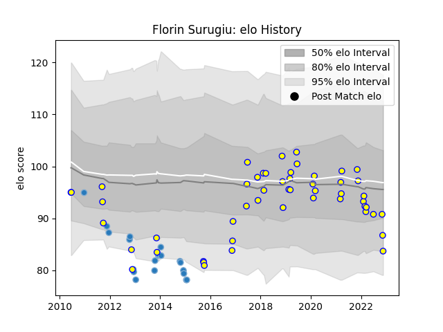

---  
layout: page  
title: Florin Surugiu  
date: 2022-11-16 11:21:06.370895  
categories: player  
---
# Florin Surugiu

## Positions: SH

## Country: Romania

## Current elo: 84.0

## Current Percentile: 22.0

# Elo History

# Match History

| Team      |   Appearances |   Win Rate |
|:----------|--------------:|-----------:|
| Romania   |            50 |       0.54 |
| Bucuresti |            20 |       0.2  |

| Opponent                 |   Matches |   Win Rate |
|:-------------------------|----------:|-----------:|
| Spain                    |         5 |   0.4      |
| Georgia                  |         5 |   0        |
| Newcastle Falcons        |         4 |   0        |
| Uruguay                  |         4 |   0.5      |
| Russia                   |         4 |   0.5      |
| Calvisano                |         4 |   0.75     |
| Canada                   |         4 |   1        |
| Portugal                 |         4 |   0.75     |
| Stade Francais Paris     |         4 |   0        |
| United States of America |         3 |   0.333333 |
| Tonga                    |         3 |   0.666667 |
| Germany                  |         2 |   1        |
| Japan                    |         2 |   0        |
| Agen                     |         2 |   0.5      |
| Chile                    |         2 |   1        |
| Brive                    |         2 |   0        |
| Brazil                   |         2 |   1        |
| Dragons                  |         2 |   0        |
| Scotland                 |         1 |   0        |
| Samoa                    |         1 |   1        |
| Italy                    |         1 |   0        |
| Netherlands              |         1 |   1        |
| Italy A                  |         1 |   1        |
| Argentina                |         1 |   0        |
| Ireland                  |         1 |   0        |
| France                   |         1 |   0        |
| Belgium                  |         1 |   1        |
| Bath Rugby               |         1 |   0        |
| Argentina Jaguares       |         1 |   1        |
| Worcester Warriors       |         1 |   0        |