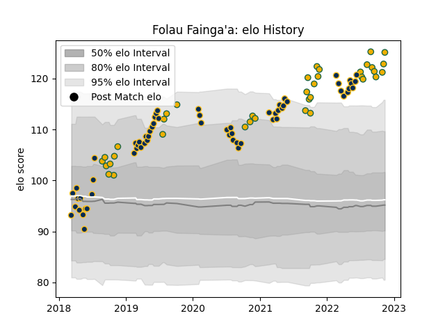

---  
layout: page  
title: Folau Fainga'a  
date: 2022-11-16 11:33:53.079381  
categories: player  
---
# Folau Fainga'a

## Positions: H

## Country: Australia

## Current elo: 125.0

## Current Percentile: 98.0

# Elo History

# Match History

| Team      |   Appearances |   Win Rate |
|:----------|--------------:|-----------:|
| Brumbies  |            63 |   0.587302 |
| Australia |            37 |   0.5      |

| Opponent                 |   Matches |   Win Rate |
|:-------------------------|----------:|-----------:|
| Queensland Reds          |        12 |   0.5      |
| Argentina                |         9 |   0.777778 |
| New Zealand              |         9 |   0.277778 |
| Melbourne Rebels         |         8 |   0.375    |
| South Africa             |         7 |   0.571429 |
| New South Wales Waratahs |         7 |   0.857143 |
| Western Force            |         6 |   1        |
| England                  |         4 |   0.25     |
| Hurricanes               |         4 |   0.75     |
| Blues                    |         4 |   0.25     |
| Highlanders              |         3 |   0.333333 |
| Sunwolves                |         3 |   1        |
| Crusaders                |         3 |   0        |
| Chiefs                   |         3 |   0.666667 |
| Jaguares                 |         3 |   0        |
| Scotland                 |         2 |   0.5      |
| Sharks                   |         2 |   1        |
| Bulls                    |         2 |   1        |
| Italy                    |         2 |   0.5      |
| Lions                    |         2 |   0.5      |
| France                   |         1 |   0        |
| Japan                    |         1 |   1        |
| Stormers                 |         1 |   1        |
| Uruguay                  |         1 |   1        |
| Wales                    |         1 |   0        |