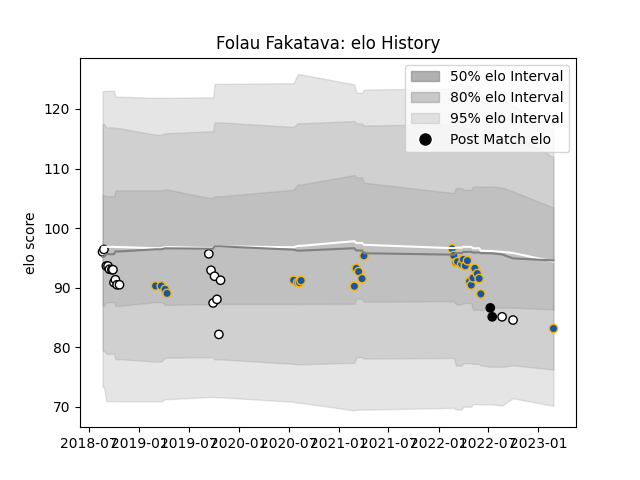

---  
layout: page  
title: Folau Fakatava  
date: 2023-03-17 17:22:17.264937  
categories: player  
---
# Folau Fakatava

## Positions: SH

## Country: New Zealand

## Current elo: 83.0

## Current Percentile: 18.0

# Elo History

# Match History

| Team        |   Appearances |   Win Rate |
|:------------|--------------:|-----------:|
| Highlanders |            30 |   0.266667 |
| Hawke's Bay |            20 |   0.55     |
| New Zealand |             2 |   0        |

| Opponent                 |   Matches |   Win Rate |
|:-------------------------|----------:|-----------:|
| Crusaders                |         7 |   0.142857 |
| Blues                    |         7 |   0        |
| Hurricanes               |         5 |   0.2      |
| Bay of Plenty            |         3 |   0.333333 |
| Tasman                   |         3 |   0.333333 |
| Chiefs                   |         3 |   0.666667 |
| Otago                    |         3 |   0.666667 |
| Manawatu                 |         2 |   1        |
| Waikato                  |         2 |   0.5      |
| Melbourne Rebels         |         2 |   0        |
| Ireland                  |         2 |   0        |
| Counties Manukau         |         2 |   0.5      |
| Fijian Drua              |         1 |   1        |
| Moana Pasifika           |         1 |   1        |
| New South Wales Waratahs |         1 |   0        |
| North Harbour            |         1 |   0        |
| Northland                |         1 |   1        |
| Queensland Reds          |         1 |   1        |
| Southland                |         1 |   1        |
| Taranaki                 |         1 |   1        |
| Canterbury               |         1 |   0        |
| Brumbies                 |         1 |   0        |
| Western Force            |         1 |   1        |