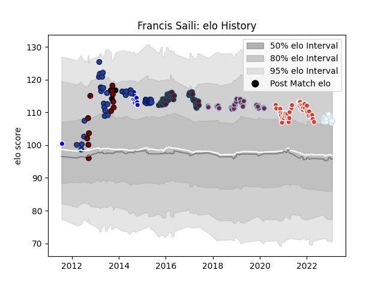

---  
layout: page  
title: Francis Saili  
date: 2023-02-02 18:48:52.777993  
categories: player  
---
# Francis Saili

## Positions: C

## Country: New Zealand

## Current elo: 107.0

## Current Percentile: 75.0

# Elo History

# Match History

| Team               |   Appearances |   Win Rate |
|:-------------------|--------------:|-----------:|
| Biarritz Olympique |            42 |   0.47619  |
| Blues              |            42 |   0.309524 |
| Munster            |            40 |   0.7      |
| Harlequins         |            29 |   0.413793 |
| Racing 92          |            16 |   0.59375  |
| North Harbour      |            13 |   0.192308 |
| Auckland           |            10 |   0.65     |
| New Zealand        |             2 |   1        |

| Opponent                   |   Matches |   Win Rate |
|:---------------------------|----------:|-----------:|
| Chiefs                     |         6 |   0        |
| Benetton Treviso           |         6 |   0.833333 |
| Highlanders                |         5 |   0.2      |
| Perpignan                  |         5 |   0.4      |
| Leinster                   |         5 |   0.2      |
| Ulster                     |         5 |   0.6      |
| Hurricanes                 |         5 |   0.4      |
| Clermont Auvergne          |         4 |   0.25     |
| La Rochelle                |         4 |   0.5      |
| Brumbies                   |         4 |   0.5      |
| Crusaders                  |         4 |   0.25     |
| Racing 92                  |         4 |   0.75     |
| Montpellier Herault        |         4 |   0.25     |
| Connacht                   |         4 |   0.5      |
| Ospreys                    |         4 |   0.75     |
| Pau                        |         3 |   0.333333 |
| Stade Francais Paris       |         3 |   0.666667 |
| Toulon                     |         3 |   0.333333 |
| Stade Toulousain           |         3 |   0.333333 |
| Tasman                     |         3 |   0.833333 |
| Grenoble                   |         3 |   0.666667 |
| Stormers                   |         3 |   0.333333 |
| Northland                  |         3 |   0.5      |
| New South Wales Waratahs   |         3 |   0.333333 |
| Scarlets                   |         3 |   0.333333 |
| Cardiff Blues              |         3 |   0.666667 |
| Edinburgh                  |         3 |   1        |
| Brive                      |         3 |   0.666667 |
| Wellington                 |         3 |   0.666667 |
| Worcester Warriors         |         3 |   0.333333 |
| Western Force              |         3 |   1        |
| Exeter Chiefs              |         3 |   0.666667 |
| Soyaux-Angouleme           |         2 |   1        |
| Southland                  |         2 |   0        |
| Bath Rugby                 |         2 |   1        |
| Nevers                     |         2 |   0.5      |
| Saracens                   |         2 |   0        |
| Bordeaux Begles            |         2 |   0.5      |
| Oyonnax                    |         2 |   0.5      |
| Otago                      |         2 |   0        |
| Bristol Rugby              |         2 |   0.5      |
| Bulls                      |         2 |   0.5      |
| Newcastle Falcons          |         2 |   1        |
| Canterbury                 |         2 |   0        |
| Glasgow Warriors           |         2 |   1        |
| Gloucester Rugby           |         2 |   0.5      |
| Montauban                  |         2 |   0.5      |
| Melbourne Rebels           |         2 |   0.5      |
| Wasps                      |         2 |   0.5      |
| Lyon                       |         2 |   0.5      |
| Cheetahs                   |         2 |   0        |
| Colomiers                  |         2 |   1        |
| Waikato                    |         2 |   0.5      |
| Leicester Tigers           |         2 |   0        |
| Dragons                    |         2 |   1        |
| Valence Romans Drome Rugby |         2 |   0.5      |
| Vannes                     |         2 |   0.5      |
| Harlequins                 |         2 |   0.5      |
| Manawatu                   |         2 |   0.5      |
| Taranaki                   |         1 |   0        |
| Sharks                     |         1 |   0        |
| Agen                       |         1 |   1        |
| Sale Sharks                |         1 |   0        |
| Japan                      |         1 |   1        |
| Aurillac                   |         1 |   1        |
| Bay of Plenty              |         1 |   1        |
| Beziers                    |         1 |   0        |
| Castres Olympique          |         1 |   0.5      |
| Counties Manukau           |         1 |   0        |
| Hawke's Bay                |         1 |   0        |
| Lions                      |         1 |   0        |
| Rouen                      |         1 |   1        |
| London Irish               |         1 |   0        |
| Argentina                  |         1 |   1        |
| Mont-de-Marsan             |         1 |   0.5      |
| Northampton Saints         |         1 |   0        |
| Provence Rugby             |         1 |   0.5      |
| Queensland Reds            |         1 |   0        |
| Zebre                      |         1 |   1        |