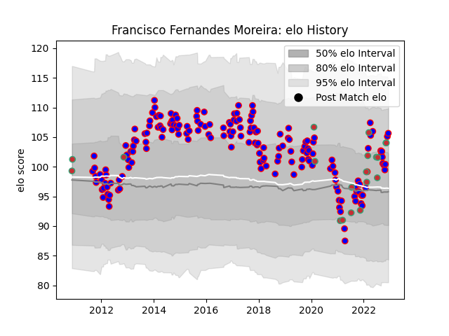

---  
layout: page  
title: Francisco Fernandes Moreira  
date: 2022-12-18 16:16:28.299229  
categories: player  
---
# Francisco Fernandes Moreira

## Positions: P

## Country: Portugal

## Current elo: 105.0

## Current Percentile: 81.0

# Elo History

# Match History

| Team     |   Appearances |   Win Rate |
|:---------|--------------:|-----------:|
| Beziers  |           181 |   0.516575 |
| Portugal |            19 |   0.447368 |

| Opponent                   |   Matches |   Win Rate |
|:---------------------------|----------:|-----------:|
| Colomiers                  |        13 |   0.538462 |
| Aurillac                   |        11 |   0.727273 |
| Carcassonne                |        11 |   0.272727 |
| Oyonnax                    |        10 |   0.35     |
| Narbonne                   |        10 |   0.7      |
| Dax                        |        10 |   0.4      |
| Mont-de-Marsan             |         9 |   0.611111 |
| Grenoble                   |         9 |   0.333333 |
| Tarbes                     |         9 |   0.555556 |
| Biarritz Olympique         |         8 |   0.375    |
| Provence Rugby             |         7 |   0.714286 |
| Soyaux-Angouleme           |         6 |   0.5      |
| Montauban                  |         6 |   0.583333 |
| Agen                       |         6 |   1        |
| Vannes                     |         6 |   0.333333 |
| Nevers                     |         5 |   0.6      |
| Rouen                      |         5 |   0.6      |
| Perpignan                  |         5 |   0.4      |
| Bourgoin-Jallieu           |         5 |   0.8      |
| Pau                        |         4 |   0        |
| La Rochelle                |         4 |   0.25     |
| Lyon                       |         3 |   0.666667 |
| Bayonne                    |         3 |   0.666667 |
| Albi                       |         3 |   0.666667 |
| US Bressane                |         3 |   0.333333 |
| Romania                    |         3 |   0.333333 |
| Massy                      |         3 |   0.333333 |
| Spain                      |         2 |   0        |
| Auch                       |         2 |   1        |
| Russia                     |         2 |   0.5      |
| Georgia                    |         2 |   0.25     |
| Netherlands                |         2 |   1        |
| Brive                      |         2 |   0        |
| Japan                      |         1 |   0        |
| Hong Kong                  |         1 |   1        |
| Kenya                      |         1 |   1        |
| Italy                      |         1 |   0        |
| Roval Drome XV             |         1 |   1        |
| Namibia                    |         1 |   1        |
| Argentina                  |         1 |   0        |
| Canada                     |         1 |   0        |
| Uruguay                    |         1 |   1        |
| Valence Romans Drome Rugby |         1 |   1        |
| Périgueux                  |         1 |   0        |