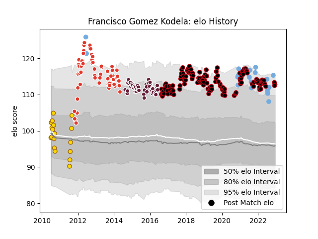

---  
layout: page  
title: Francisco Gomez Kodela  
date: 2022-11-16 11:26:00.266981  
categories: player  
---
# Francisco Gomez Kodela

## Positions: P

## Country: Argentina

## Current elo: 113.0

## Current Percentile: 95.0

# Elo History

# Match History

| Team               |   Appearances |   Win Rate |
|:-------------------|--------------:|-----------:|
| Lyon               |           126 |   0.551587 |
| Biarritz Olympique |            62 |   0.459677 |
| Bordeaux Begles    |            48 |   0.541667 |
| Argentina          |            20 |   0.5      |
| Belgrano           |            18 |   0.694444 |

| Opponent             |   Matches |   Win Rate |
|:---------------------|----------:|-----------:|
| Clermont Auvergne    |        21 |   0.357143 |
| Toulon               |        19 |   0.552632 |
| Racing 92            |        17 |   0.529412 |
| Stade Francais Paris |        17 |   0.588235 |
| Montpellier Herault  |        16 |   0.5625   |
| Bordeaux Begles      |        16 |   0.4375   |
| Brive                |        14 |   0.678571 |
| Castres Olympique    |        13 |   0.230769 |
| Stade Toulousain     |        13 |   0.538462 |
| La Rochelle          |        11 |   0.272727 |
| Agen                 |         9 |   0.888889 |
| Grenoble             |         9 |   0.777778 |
| Pau                  |         9 |   0.722222 |
| Oyonnax              |         7 |   0.428571 |
| Bayonne              |         7 |   0.5      |
| Lyon                 |         6 |   0.75     |
| Australia            |         5 |   0.5      |
| Perpignan            |         4 |   0.5      |
| Leinster             |         3 |   0        |
| Saracens             |         3 |   0.333333 |
| Ospreys              |         3 |   0.666667 |
| Wales                |         3 |   0.5      |
| Scotland             |         3 |   0.666667 |
| Olivos               |         2 |   1        |
| Italy                |         2 |   1        |
| Sale Sharks          |         2 |   0        |
| Biarritz Olympique   |         2 |   1        |
| South Africa         |         2 |   0        |
| Alumni               |         2 |   0        |
| London Welsh         |         2 |   1        |
| Connacht             |         2 |   0.5      |
| France               |         2 |   0        |
| Exeter Chiefs        |         2 |   0.5      |
| Newman               |         2 |   1        |
| Pucara               |         2 |   0.5      |
| San Luis             |         1 |   1        |
| SIC                  |         1 |   1        |
| Worcester Warriors   |         1 |   1        |
| San Albano           |         1 |   1        |
| Wasps                |         1 |   1        |
| Lomas                |         1 |   1        |
| Northampton Saints   |         1 |   0        |
| New Zealand          |         1 |   1        |
| Manuel Belgrano      |         1 |   1        |
| La Plata             |         1 |   1        |
| Ireland              |         1 |   0        |
| Hindu                |         1 |   0        |
| Harlequins           |         1 |   0        |
| Gloucester Rugby     |         1 |   1        |
| England              |         1 |   1        |
| Edinburgh            |         1 |   0        |
| Champagnat           |         1 |   1        |
| Cardiff Blues        |         1 |   0        |
| CASI                 |         1 |   0        |
| Benetton Treviso     |         1 |   1        |
| Atlético del Rosario |         1 |   0.5      |
| Zebre                |         1 |   1        |